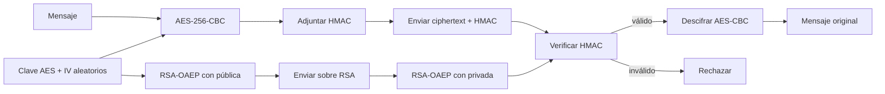

# Algoritmo híbrido RSA + AES

El proyecto cifra mensajes con una clave AES efímera y protege esa clave con
RSA. La API pública está en `utils` y `main.py` solo coordina las llamadas.

## Funcionamiento

1. El emisor genera una clave AES aleatoria de 32 bytes y un IV aleatorio de
   16 bytes.
2. Cifra el texto mediante AES-256-CBC con relleno PKCS#7.
3. Deriva una clave de autenticación mediante HKDF-SHA-256 y añade un
   HMAC-SHA-256 calculado sobre `IV || ciphertext`.
4. Empaqueta `clave AES || IV` y cifra los 48 bytes con la clave pública del
   receptor usando RSA-OAEP con SHA-256.
5. El receptor abre el paquete RSA con su clave privada, verifica el HMAC y,
   solo si es válido, descifra AES y elimina el relleno.

`iv_cifrado_RSA` conserva el nombre exigido por el enunciado, pero contiene el
sobre RSA completo (clave AES e IV). Así las dos salidas bastan para recuperar
el mensaje.



## Elecciones de diseño

- **AES-256:** clave aleatoria de 32 bytes generada por el sistema operativo.
- **IV de 16 bytes:** AES siempre tiene bloques de 128 bits; CBC exige que el IV
  mida exactamente un bloque. La indicación de 32 bytes del enunciado no es
  válida para AES-CBC y las bibliotecas criptográficas la rechazan.
- **RSA de al menos 2048 bits:** exponente público 65537 y OAEP-SHA-256. OAEP
  aporta aleatoriedad y evita los problemas del RSA matemático sin padding.
- **HMAC-SHA-256:** CBC cifra pero no detecta alteraciones. Encrypt-then-MAC
  evita entregar texto manipulado y ataques de padding oracle.
- **Una clave AES por mensaje:** evita reutilización de material criptográfico.

## Uso

```python
from utils import generar_claves_rsa, get_Msj_And_Key, decifrar_mensaje

RSA_Publica, RSA_Privada = generar_claves_rsa()
iv_cifrado_RSA, mensajeCifrado_AES = get_Msj_And_Key(RSA_Publica, "Mensaje")
original = decifrar_mensaje(mensajeCifrado_AES, iv_cifrado_RSA, RSA_Privada)
```

La función auxiliar requiere también la clave, porque el IV no es una clave:

```python
import os
from utils import Cifrado_AES_enviar_mensaje

clave = os.urandom(32)
iv = os.urandom(16)
cifrado_autenticado = Cifrado_AES_enviar_mensaje("Mensaje", iv, clave)
```

Si se omite el mensaje en `get_Msj_And_Key(RSA_Publica)`, la función lo solicita
de forma interactiva sin mostrarlo en pantalla.

Al ejecutar `python main.py` se muestran, con fines didácticos, las claves RSA
en formato PEM, el sobre RSA, el criptograma AES con su HMAC y el texto final.
La clave privada jamás debe imprimirse de esta manera en producción.

## Pruebas

```bash
python -m pip install -r requirements.txt
python -m unittest discover -v
```

Cada archivo de pruebas incluye además un caso que imprime un mensaje cifrado.
Las pruebas cubren el ejemplo RSA que estaba comentado, vuelta completa del
esquema híbrido, Unicode, aleatoriedad, claves PEM, manipulación del ciphertext,
clave privada incorrecta y validación de tamaños.

## Análisis de seguridad

El mensaje solo queda expuesto a quien posea la clave privada RSA; la clave AES
no se transmite en claro. OAEP y los valores aleatorios hacen que cifrar dos
veces el mismo texto produzca resultados diferentes. El HMAC proporciona
integridad y autenticidad frente a cambios accidentales o maliciosos.

El sistema no autentica por sí solo la identidad del emisor: para ello se debe
añadir una firma digital y validar certificados. Tampoco protege claves privadas
guardadas sin contraseña ni metadatos externos (tamaño y momento del mensaje).
En una aplicación nueva normalmente se preferiría AES-GCM, que integra cifrado
y autenticación; aquí se conserva CBC porque es un requisito del ejercicio.

# Creador
Jose Manuel Castillo Queh :D