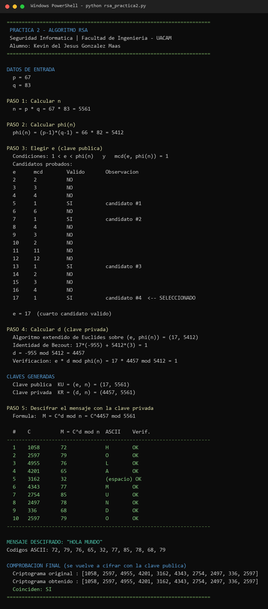

<p align="center">
  
</p>

<h1 align="center">🔑 Algoritmo RSA — Generación de claves y descifrado</h1>

<p align="center">
  <strong>Práctica 2 — Seguridad Informática</strong><br>
  Facultad de Ingeniería · Universidad Autónoma de Campeche (UACAM)
</p>

<p align="center">
  
  
  
  
</p>

---

## 📋 Descripción

En esta práctica reproduje **paso a paso el algoritmo RSA** con los datos que nos dio el profesor
(`p = 67`, `q = 83`), generé el par de claves y descifré el criptograma de la práctica.

Lo importante aquí es que **no usé librerías de criptografía**. Todo lo que hace falta lo programé
a mano para poder explicar el procedimiento y compararlo con el desarrollo hecho en papel:

| Operación | Función en el código | Método usado |
|-----------|----------------------|--------------|
| Máximo común divisor | `mcd(a, b)` | Algoritmo de Euclides (iterativo) |
| Inverso multiplicativo | `euclides_extendido()` + `inverso_multiplicativo()` | Algoritmo extendido de Euclides |
| Potencia modular | `exponenciacion_modular()` | Cuadrados sucesivos (exponenciación binaria) |
| Búsqueda de `e` | `buscar_candidatos_e()` | Recorrido de candidatos con `mcd(e, φ(n)) = 1` |

> **¿Por qué exponenciación modular y no `C ** d % n`?**
> Porque `C^4457` es un número de miles de dígitos. Con el método de cuadrados sucesivos el
> resultado sale igual, pero sin que Python tenga que construir ese número gigante.

---

## 🧮 Desarrollo matemático

```
Datos de entrada:   p = 67        q = 83

Paso 1   n      = p * q           = 67 * 83 = 5561
Paso 2   φ(n)   = (p-1)*(q-1)     = 66 * 82 = 5412
Paso 3   e      = cuarto valor con 1 < e < φ(n) y mcd(e, φ(n)) = 1
         candidatos: 5, 7, 13, 17   →   e = 17
Paso 4   d      = e⁻¹ mod φ(n)    = 17⁻¹ mod 5412 = 4457
         comprobación: 17 * 4457 mod 5412 = 1  ✓
Paso 5   M      = C^d mod n       = C^4457 mod 5561
```

**Claves obtenidas**

| Clave | Par | Valor |
|-------|-----|-------|
| 🔓 Pública | `KU = (e, n)` | **(17, 5561)** |
| 🔒 Privada | `KR = (d, n)` | **(4457, 5561)** |

> **Nota sobre el paso 3:** el profesor pidió el **cuarto** candidato válido, no el primero.
> Por eso el programa imprime la tabla completa de candidatos probados (`e = 2 … 17`), para
> justificar que 5, 7 y 13 también cumplen pero el que corresponde es **17**.

---

## 🚀 Cómo ejecutarlo

No necesita instalar nada: el script usa solo la librería estándar de Python.

### 1️⃣ Requisito previo

| Herramienta | Versión mínima |
|-------------|----------------|
| 🐍 **Python** | 3.8 o superior |

### 2️⃣ Ejecutar

```bash
cd P02-RSA
python rsa_practica2.py
```

> [!NOTE]
> En Windows, si `python` no es reconocido, prueba con `py rsa_practica2.py`.
> En Linux o macOS puede ser `python3 rsa_practica2.py`.

---

## 📂 Estructura del proyecto

```
P02-RSA/
│
├── 🐍 rsa_practica2.py        # Todo el algoritmo (sin dependencias externas)
├── 📄 INSTRUCTIONS.MD         # Enunciado de la práctica
├── 🖼️ capturas/               # Evidencias de la ejecución
└── 📖 README.md               # Este archivo
```

---

## 🖼️ Evidencia de la ejecución

**Captura 1.** Corrida completa del programa: datos de entrada, cálculo de `n` y `φ(n)`, tabla de
candidatos de `e`, obtención de `d` con Euclides extendido, claves generadas, descifrado del
criptograma carácter por carácter y comprobación final.



---

## ✅ Resultado del descifrado

El criptograma que entregó el profesor era:

```
1058  2597  4955  4201  3162  4343  2754  2497  336  2597
```

Aplicando `M = C^4457 mod 5561` a cada bloque:

| # | C | M = C^d mod n | Carácter |
|---|------|-----|-----------|
| 1 | 1058 | 72 | `H` |
| 2 | 2597 | 79 | `O` |
| 3 | 4955 | 76 | `L` |
| 4 | 4201 | 65 | `A` |
| 5 | 3162 | 32 | *(espacio)* |
| 6 | 4343 | 77 | `M` |
| 7 | 2754 | 85 | `U` |
| 8 | 2497 | 78 | `N` |
| 9 | 336  | 68 | `D` |
| 10 | 2597 | 79 | `O` |

<p align="center">
  <strong>🎯 Mensaje descifrado: <code>HOLA MUNDO</code></strong>
</p>

### 🔁 Doble comprobación

Para no quedarme solo con "salió una palabra que se lee bien", el programa vuelve a **cifrar** el
mensaje recuperado con la clave pública (`C = M^17 mod 5561`) y compara contra el criptograma
original. Los diez valores coinciden uno por uno, así que el par de claves es correcto:

```
Criptograma original : [1058, 2597, 4955, 4201, 3162, 4343, 2754, 2497, 336, 2597]
Criptograma obtenido : [1058, 2597, 4955, 4201, 3162, 4343, 2754, 2497, 336, 2597]
Coinciden: SI
```

---

## 🔎 Observaciones

- Los valores `p = 67` y `q = 83` son **didácticos**. Con `n = 5561` la clave se rompe por fuerza
  bruta en un instante: basta factorizar `n` para obtener `φ(n)` y de ahí `d`. En un sistema real
  se usan primos de 1024 bits o más (ver la Práctica 3, donde ya trabajo con RSA de 2048 bits).
- Como el cifrado se hace **carácter por carácter**, el mismo carácter siempre da el mismo bloque
  (la `O` aparece dos veces y en ambas da `2597`). Eso es una fuga de información clásica del RSA
  "de libro"; por eso en la práctica siguiente se usa relleno **OAEP**.
- El programa imprime también los códigos ASCII, que es lo que se pedía como evidencia intermedia.

---

## 🧑‍🎓 Datos académicos

| Campo | Detalle |
|-------|---------|
| 📝 **Práctica** | Práctica 2 — Algoritmo RSA |
| 📚 **Materia** | Seguridad Informática |
| 🏫 **Institución** | Facultad de Ingeniería — UACAM |
| 👨‍💻 **Alumno** | Kevin del Jesús González Maas |
| 👨‍🏫 **Docente** | Sergio A. Noh Puch |
| 🎓 **Grado / Grupo** | 7° semestre, Grupo "A" |

---

<p align="center">
  
  &nbsp;&nbsp;
  <strong>Hecho con Python</strong> 🐍
  &nbsp;&nbsp;
  
</p>
