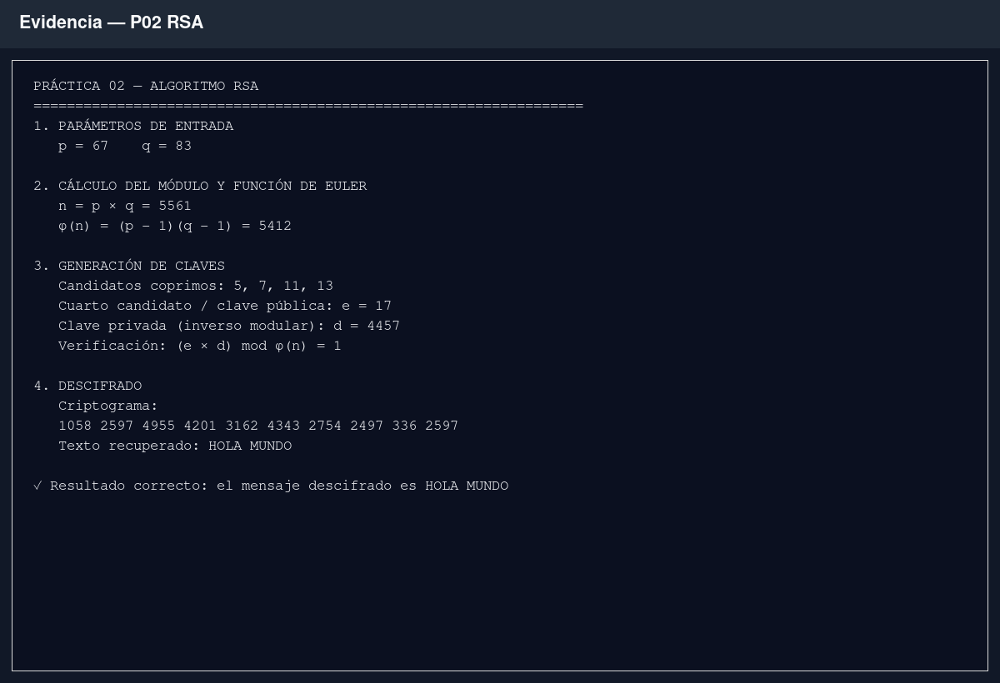

# Resultados — Práctica 02: RSA

## Ejecución

La implementación calculó el par de claves RSA didáctico a partir de `p = 67`
y `q = 83`:

- `n = 5561`
- `φ(n) = 5412`
- cuarto exponente público válido: `e = 17`
- exponente privado: `d = 4457`
- comprobación: `(e × d) mod φ(n) = 1`

Al aplicar la clave privada al criptograma indicado en la práctica se recuperó
el texto `HOLA MUNDO`.



*Captura 1. Ejecución completa: parámetros, cálculo de claves, verificación del
inverso modular y descifrado del criptograma.*

## Verificación

Se ejecutaron las cuatro pruebas específicas de RSA:

```bash
python -m unittest tests.test_rsa -v
```

Resultado: **4 pruebas correctas**. Se verificaron el cifrado y descifrado de un
entero, el mensaje del enunciado, el ejemplo visible `RSA` y el rechazo de
valores fuera del módulo.
