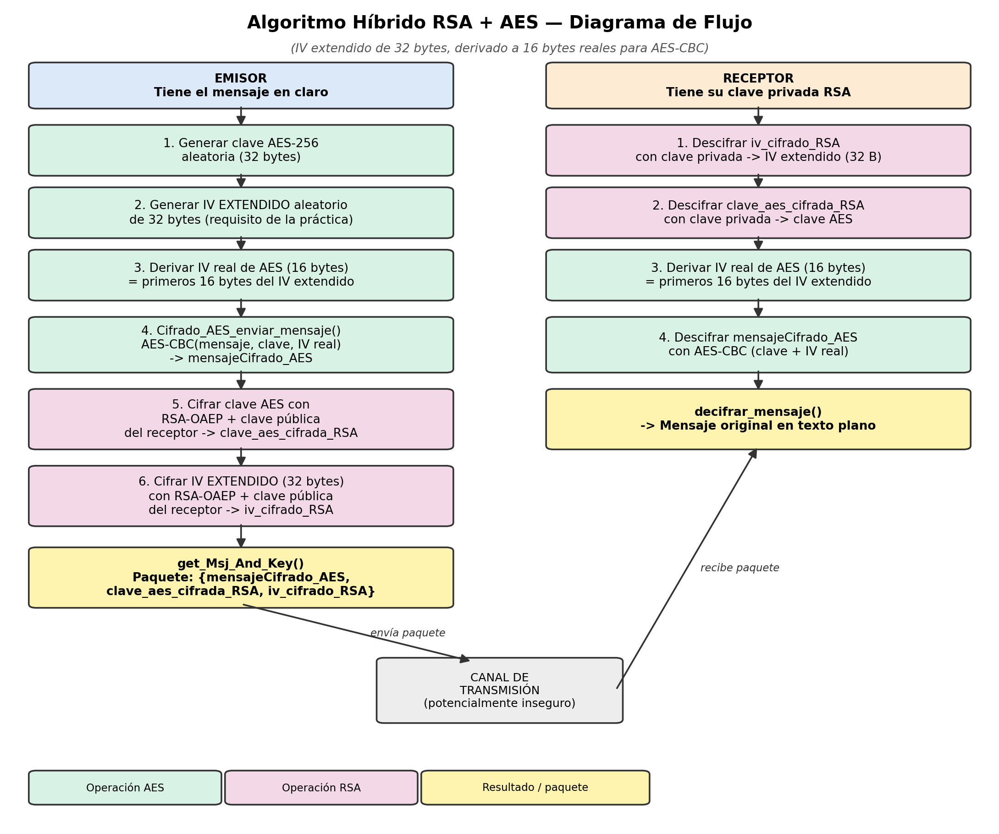

# Seguridad Informática — Mauricio A. Sonda Cahuich
## Práctica 2 — Algoritmo Híbrido RSA + AES
### Documentación técnica del sistema

Explicación del algoritmo, justificación de diseño, diagrama de flujo, pruebas y análisis de seguridad

---

## 1. ¿Cómo funciona el algoritmo híbrido?

La idea de un cifrado "híbrido" es aprovechar lo mejor de dos mundos: AES y RSA.

Por un lado, AES es un cifrado simétrico, es decir, usa la misma clave para cifrar y descifrar. Es muy rápido, ideal para cifrar mensajes largos, pero tiene un problema: ¿cómo le hago llegar esa clave a la otra persona sin que alguien más la intercepte?

Ahí es donde entra RSA. RSA es un cifrado asimétrico: usa una clave pública (que puede compartirse libremente) y una clave privada (que nunca se comparte). El problema de RSA es que es lento y no conviene usarlo para cifrar mensajes grandes.

Entonces la solución que usé (que además es básicamente lo mismo que hacen protocolos reales como TLS o PGP) es: cifro el mensaje con AES porque es rápido, y luego cifro la clave de AES con RSA para poder enviársela de forma segura al receptor. Como el enunciado también pedía cifrar el IV, lo hice de la misma manera.

### 1.1 Sobre el IV de 32 bytes

Aquí me encontré con algo interesante mientras hacía la práctica: pide un IV de 32 bytes, pero investigando me di cuenta de que AES-CBC en realidad siempre necesita un IV de 16 bytes exactos (porque ese es el tamaño de bloque de AES, sin importar si la clave es de 128, 192 o 256 bits). Si intentaba usar un IV de 32 bytes directamente, la librería me marcaba error.

Para poder hacer que el código funcionara correctamente, se me ocurrió lo siguiente, que llamé "IV extendido":

1. Genero un IV de 32 bytes al azar, tal como se pide.
2. De esos 32 bytes, solo tomo los primeros 16 y esos son los que realmente usa AES para cifrar.

Lo bueno de esto es que no se pierde nada de seguridad: si los 32 bytes ya salieron de un generador aleatorio seguro, entonces los primeros 16 bytes de ese resultado son tan aleatorios como si los hubiera generado directamente con 16 bytes. Los otros 16 bytes que "sobran" simplemente viajan cifrados junto con todo lo demás, pero AES no los usa.

> Esta parte del código (la función `_derivar_iv_aes`) la uso igual tanto para cifrar como para descifrar, así que el emisor y el receptor siempre llegan al mismo IV real de 16 bytes.

### 1.2 Lo que pasa del lado de quien envía el mensaje

- Genero una clave AES-256 nueva y aleatoria (una clave distinta cada vez que se manda un mensaje).
- Genero el IV extendido de 32 bytes.
- De ahí saco el IV real de 16 bytes.
- Cifro el mensaje con AES-CBC usando esa clave y ese IV real -> obtengo `mensajeCifrado_AES`.
- Cifro la clave AES con la clave pública RSA de quien va a recibir el mensaje -> `clave_aes_cifrada_RSA`.
- Cifro también el IV extendido completo (los 32 bytes) con la misma clave pública -> `iv_cifrado_RSA`.
- Al final mando estos tres datos juntos: `mensajeCifrado_AES`, `clave_aes_cifrada_RSA` e `iv_cifrado_RSA`.

### 1.3 Lo que pasa del lado de quien recibe el mensaje

- Descifra `iv_cifrado_RSA` usando su clave privada y así recupera el IV extendido de 32 bytes.
- Descifra `clave_aes_cifrada_RSA` usando su clave privada y recupera la clave AES.
- Saca el IV real de 16 bytes de ese IV extendido (exactamente igual que hizo quien envió el mensaje).
- Con la clave AES y el IV real ya puede descifrar `mensajeCifrado_AES` y leer el mensaje original.

La parte importante es que solo quien tiene la clave privada correcta puede llegar a recuperar la clave AES y el IV, y por lo tanto, el mensaje. Si alguien intercepta el paquete en el camino, solo ve datos cifrados, nada que se pueda leer.

---

## 2. Por qué elegí cada cosa así

### 2.1 RSA de 2048 bits

Elegí 2048 bits porque es el tamaño mínimo que hoy en día se considera seguro (NIST y otros estándares ya no recomiendan usar 1024 bits, se puede romper con suficiente poder de cómputo). No usé 4096 porque en este caso RSA solo cifra cosas pequeñas (la clave AES y el IV), así que no hacía falta ir más grande; 2048 ya da un buen balance entre seguridad y velocidad.

### 2.2 AES de 256 bits (32 bytes)

El enunciado pedía una clave de 32 bytes, y eso es justo lo que se necesita para AES-256, la versión más fuerte de AES que existe. Es una decisión segura.

### 2.3 Modo CBC

Pide CBC, así que lo usé tal cual. Lo que hace CBC es encadenar cada bloque con el anterior, para que dos bloques de texto plano iguales no generen el mismo resultado cifrado (a diferencia del modo ECB, que sí tiene ese problema y por eso se considera inseguro). Como CBC trabaja con bloques de tamaño fijo, hay que rellenar el mensaje si no es múltiplo exacto de 16 bytes; para eso usé PKCS7, que es el relleno más común para esto.

### 2.4 Cómo resolví lo del IV de 32 bytes

Como comenté antes, la solución fue el "IV extendido". Antes de quedarme con esa opción, pensé en otras dos formas de resolverlo y las descarté:

| Qué se me ocurrió | Por qué no funcionaba |
|---|---|
| Usar directamente los 32 bytes como IV de AES | No se puede, AES-CBC simplemente no acepta un IV que no mida 16 bytes exactos. |
| Generar el IV de 32 bytes pero tirar los otros 16 sin usarlos ni transmitirlos | Esto sí haría que AES funcionara, pero ya no estaría cumpliendo lo que pidió de mandar un IV de 32 bytes. |
| **Generar 32 bytes y usar solo los primeros 16 para AES (la que usé)** | AES recibe un IV válido y totalmente aleatorio. |

Esta última fue la que implementé: la función `_derivar_iv_aes()` revisa que el IV tenga los 32 bytes y de ahí devuelve solo los primeros 16, que son los que usa AES. Siempre que le doy el mismo IV extendido, me da el mismo resultado, así que no hay riesgo de que emisor y receptor no coincidan.

### 2.5 Por qué usé OAEP en vez de PKCS1 v1.5 para RSA

Para cifrar con RSA (tanto la clave AES como el IV) usé un relleno llamado OAEP en lugar del más viejo PKCS#1 v1.5. La razón es que PKCS#1 v1.5 tiene una vulnerabilidad conocida (el ataque de Bleichenbacher) que en ciertos casos permite a alguien descifrar información sin tener la clave privada. OAEP es la opción que encontré que se recomienda hoy en día para evitar ese problema.

### 2.6 Cómo genero los números aleatorios

Tanto la clave AES como el IV los genero con `os.urandom()`, que usa el generador aleatorio seguro del sistema operativo. No usé el módulo `random` normal de Python porque ese no sirve para cosas de seguridad, ya que sus resultados se pueden predecir.

---

## 3. Diagrama de flujo del proceso

Este diagrama resume todo el proceso completo, desde que se genera el mensaje hasta que se descifra del otro lado, incluyendo el paso donde se saca el IV real a partir del IV extendido:



---

## 4. Pruebas que hice para comprobar que funciona

Hice una serie de pruebas automáticas con `unittest` (en el archivo `test_rsa_aes.py`) para asegurarme de que todo funcionara bien, incluyendo casos normales, casos raros (mensajes vacíos, mensajes largos) y casos donde debería fallar a propósito (por ejemplo, si alguien usa la clave privada equivocada).

### 4.1 Ejecución de prueba (`hibrido_rsa_aes.py`)

```
Algoritmo Híbrido RSA + AES - Mauricio Sonda

Mensaje original:
  Mensaje secreto para la práctica 3 - Mau

Mensaje cifrado (AES, en hex):
  5a0ca7eeccbbc8cf4b3f4ceda59e478ee6711f232993904929ba88dc43b9dd2962024d144f3203cf1c7f54b02f0a8c7d

Clave AES cifrada (RSA, en hex, primeros 60 chars):
  8c940e47f8a5c59007bdc3335311b7ba0dcb8978107e250eff6ccc429f1a...

IV cifrado (RSA, en hex, primeros 60 chars):
  8f0d38e0b3bf2a8d3f072f7e3f2abce78091b64e749ca8e3ca41c0febfaa...

Mensaje descifrado:
  Mensaje secreto para la práctica 3 - Mau

El mensaje descifrado es el mismo que el original
```

### 4.2 Qué comprueba cada prueba (11 en total)

| Prueba | Qué comprueba |
|---|---|
| `test_ciclo_completo_cifrado_descifrado` | Que el mensaje que se descifra es exactamente igual al original |
| `test_mensaje_cifrado_no_es_texto_plano` | Que el mensaje cifrado no deja ver el texto original |
| `test_cifrados_distintos_para_mismo_mensaje` | Que cifrar el mismo mensaje dos veces da resultados distintos (por la aleatoriedad de clave e IV) |
| `test_mensaje_largo` | Que funciona con mensajes largos, de varios bloques |
| `test_mensaje_vacio` | Que no truena si el mensaje está vacío |
| `test_mensaje_con_unicode` | Que soporta acentos, ñ y hasta emojis |
| `test_funcion_auxiliar_aes` | Que la función que cifra con AES funciona bien por sí sola, con el IV de 32 bytes |
| `test_derivacion_iv_extendido_a_iv_aes` | Que sacar el IV real de 16 bytes a partir del de 32 siempre da el mismo resultado |
| `test_iv_invalido_lanza_error` | Que si el IV no mide exactamente 32 bytes, el programa lo rechaza |
| `test_clave_aes_invalida_lanza_error` | Que si la clave AES no mide un tamaño válido, también lo rechaza |
| `test_descifrado_con_clave_privada_incorrecta_falla` | Que si alguien usa una clave privada que no corresponde, no puede descifrar el mensaje |

### 4.3 Resultado de correr todas las pruebas

```
mausonda@MacBook-de-Mau Pract_03 % python3 test_rsa_aes.py                                   
test_ciclo_completo_cifrado_descifrado (__main__.TestAlgoritmoHibrido.test_ciclo_completo_cifrado_descifrado) ... ok
test_cifrados_distintos_para_mismo_mensaje (__main__.TestAlgoritmoHibrido.test_cifrados_distintos_para_mismo_mensaje) ... ok
test_clave_aes_invalida_lanza_error (__main__.TestAlgoritmoHibrido.test_clave_aes_invalida_lanza_error) ... ok
test_derivacion_iv_extendido_a_iv_aes (__main__.TestAlgoritmoHibrido.test_derivacion_iv_extendido_a_iv_aes) ... ok
test_descifrado_con_clave_privada_incorrecta_falla (__main__.TestAlgoritmoHibrido.test_descifrado_con_clave_privada_incorrecta_falla) ... ok
test_funcion_auxiliar_aes (__main__.TestAlgoritmoHibrido.test_funcion_auxiliar_aes) ... ok
test_iv_invalido_lanza_error (__main__.TestAlgoritmoHibrido.test_iv_invalido_lanza_error) ... ok
test_mensaje_cifrado_no_es_texto_plano (__main__.TestAlgoritmoHibrido.test_mensaje_cifrado_no_es_texto_plano) ... ok
test_mensaje_con_unicode (__main__.TestAlgoritmoHibrido.test_mensaje_con_unicode) ... ok
test_mensaje_largo (__main__.TestAlgoritmoHibrido.test_mensaje_largo) ... ok
test_mensaje_vacio (__main__.TestAlgoritmoHibrido.test_mensaje_vacio) ... ok

----------------------------------------------------------------------
Ran 11 tests in 0.214s

OK
```

---

## 5. Análisis de seguridad

### 5.1 Qué está bien de este sistema

- El mensaje nunca se manda en texto plano: siempre pasa por AES-256, y la clave que lo protege también va protegida por RSA-2048.
- Cada mensaje usa una clave AES distinta, generada al momento. Si alguien llegara a obtener una clave, eso no afecta a los demás mensajes.
- El esquema del IV extendido cumple con el requisito de 32 bytes sin perder que AES siga recibiendo un IV válido y aleatorio.
- Usar OAEP en vez de PKCS#1 v1.5 evita un tipo de ataque conocido contra RSA.
- Los números aleatorios se generan con una fuente segura del sistema operativo, no con un generador cualquiera.
- El código está dividido en funciones pequeñas y claras (una para AES, otra para RSA, otra para derivar el IV), lo que ayuda a revisarlo y entenderlo mejor.

### 5.2 Cosas que no están tan bien / riesgos que encontré

- No hay forma de verificar si el mensaje cifrado fue modificado en el camino. AES-CBC por sí solo no detecta si alguien alteró el texto cifrado; simplemente lo descifra y puede salir un resultado corrupto sin que nadie se dé cuenta.
- No hay manera de comprobar quién mandó realmente el mensaje. El sistema no firma nada, entonces alguien podría hacerse pasar por el emisor si logra tener la clave pública del receptor.
- Cifrar el IV con RSA en realidad no aporta mucha seguridad extra, porque el IV no tiene que ser secreto, solo aleatorio.
- No hay un manejo de las claves RSA a largo plazo (por ejemplo, qué pasa si expiran o si alguien necesita revocarlas), lo cual en un sistema real sería importante para evitar que alguien reemplace la clave pública por una falsa.
- El uso de PKCS7 junto con CBC (sin nada que verifique la integridad) puede en teoría ser vulnerable a un tipo de ataque relacionado con el padding.