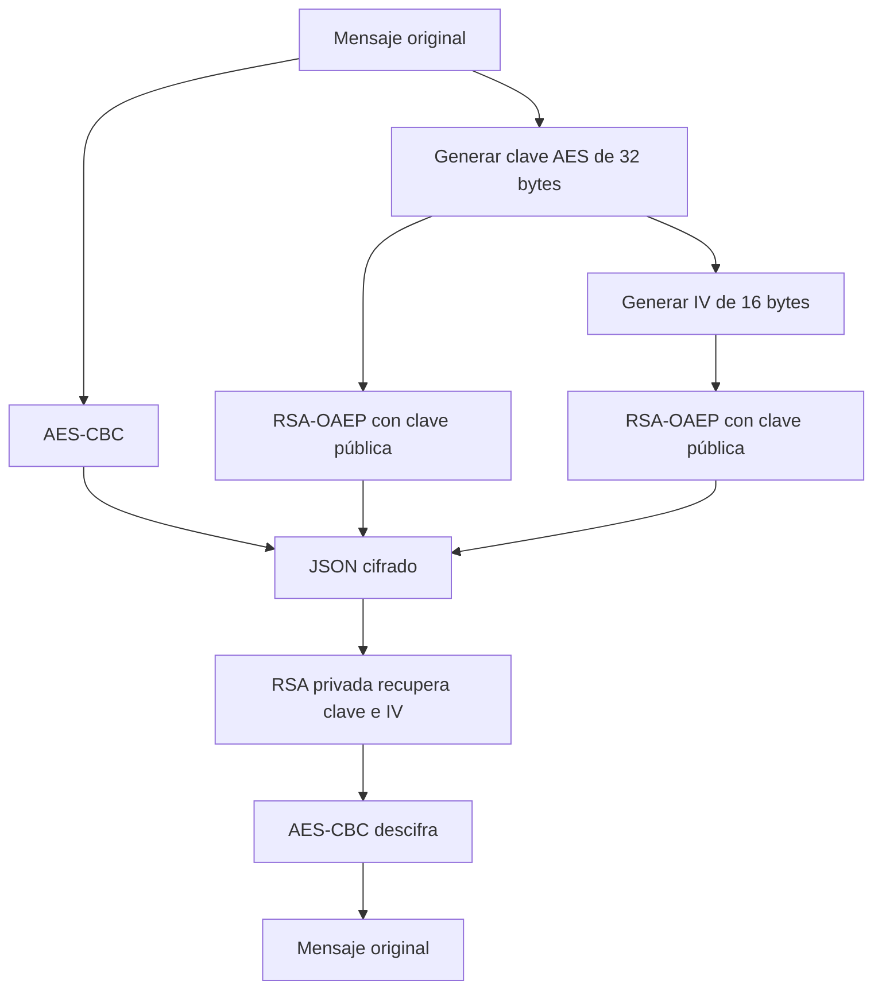

# Práctica 3: Algoritmo Híbrido RSA-AES

## Archivos

- `aes.py`: AES-256-CBC, padding PKCS#7 y generación de clave/IV.
- `rsa.py`: generación de claves RSA y cifrado RSA-OAEP.
- `hibrido.py`: funciones principales del algoritmo híbrido.
- `local_db.py`: lectura y escritura de archivos JSON.
- `main.py`: interfaz de línea de comandos.
- `test_hibrido.py`: prueba automática del flujo completo.

## Uso

Generar claves del receptor:

```bash
python3 main.py generar-claves publica.pem privada.pem
```

Ejemplo de `mensaje.json`:

```json
{
	"mensaje": "Hola, este es un mensaje secreto"
}
```

Cifrar para el receptor:

```bash
python3 main.py cifrar mensaje.json mensaje_cifrado.json publica.pem
```

Descifrar como receptor:

```bash
python3 main.py descifrar mensaje_cifrado.json mensaje_descifrado.json privada.pem
```

El JSON cifrado contiene `mensajeCifrado_AES`, `clave_cifrada_RSA` e
`iv_cifrado_RSA`, todos los valores binarios codificados en Base64.

## Funcionamiento

`get_Msj_And_Key(RSA_Publica, mensaje)` genera una clave AES de 32 bytes y un
IV de 16 bytes. Cifra el mensaje con AES-CBC y cifra la clave AES y el IV con
RSA-OAEP usando la clave pública del receptor.

`decifrar_mensaje(mensajeCifrado_AES, iv_cifrado_RSA,
clave_cifrada_RSA, RSA_Privada)` recupera la clave AES y el IV con RSA y
descifra el mensaje con AES-CBC.

`Cifrado_AES_enviar_mensaje(texto, iv, key)` aplica PKCS#7 y cifra el texto con
AES-CBC.



## Decisiones de diseño

- AES usa una clave de 256 bits.
- RSA usa claves de 2048 bits y OAEP para cifrar datos pequeños.
- Base64 permite guardar los valores binarios en JSON.

## Pruebas

```bash
python3 test_hibrido.py
```

La prueba genera claves temporales, cifra un mensaje con Unicode, lo descifra
y comprueba que el resultado coincide con el original.

## Análisis de seguridad

- La clave AES y el IV se protegen con la clave pública RSA del receptor.
- OAEP evita cifrar directamente con RSA sin relleno.
- La clave privada debe permanecer únicamente con el receptor.
- AES-CBC proporciona confidencialidad, pero no autenticación ni detección de
	alteraciones. Para producción se recomienda AES-GCM o añadir un HMAC.