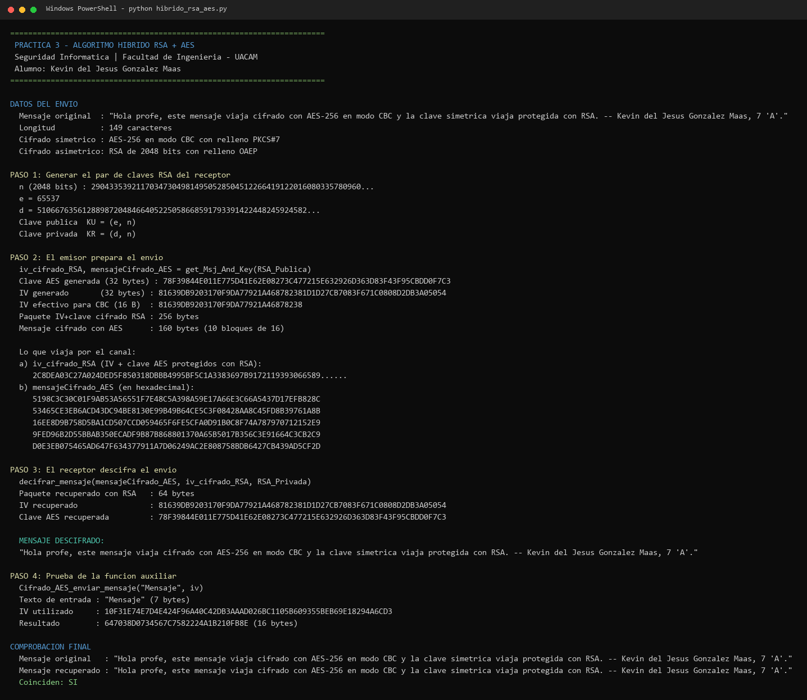
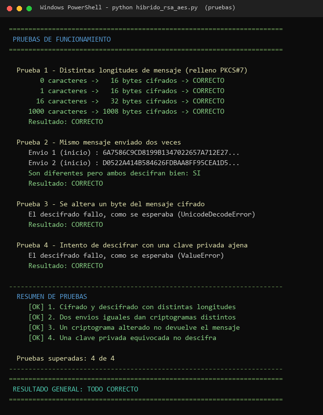

<p align="center">
  
</p>

<h1 align="center">🔐 Algoritmo Híbrido RSA + AES</h1>

<p align="center">
  <strong>Práctica 3 — Seguridad Informática</strong><br>
  Facultad de Ingeniería · Universidad Autónoma de Campeche (UACAM)
</p>

<p align="center">
  
  
  
  
  
</p>

---

## 📋 Descripción

Este proyecto implementa un **sistema de cifrado híbrido** que combina lo mejor de dos mundos:

| Algoritmo | Tipo | Rol en el sistema |
|-----------|------|-------------------|
| **AES-256 (CBC)** | Simétrico | Cifra el mensaje (rápido y eficiente) |
| **RSA-2048 (OAEP)** | Asimétrico | Protege la clave AES y el IV (seguro para intercambio) |

> **¿Por qué híbrido?**  
> AES es muy rápido para cifrar datos grandes, pero necesita que ambas partes compartan una clave secreta.  
> RSA permite intercambiar esa clave de forma segura sin ponerse de acuerdo antes.  
> Juntos, tenemos **velocidad + seguridad en el intercambio de claves**.

---

## 🏗️ ¿Cómo funciona?

```
┌─────────────────────────────────────────────────────────────────┐
│                        EMISOR                                    │
│                                                                  │
│  1. Genera clave AES aleatoria (32 bytes)                        │
│  2. Genera IV aleatorio (32 bytes)                               │
│  3. Cifra el mensaje con AES-256-CBC                             │
│  4. Empaqueta IV + clave AES (64 bytes)                          │
│  5. Cifra el paquete con la clave pública RSA del receptor       │
│                                                                  │
│  📤 Envía: [paquete cifrado con RSA] + [mensaje cifrado con AES] │
└──────────────────────────┬──────────────────────────────────────┘
                           │  Canal público
                           ▼
┌─────────────────────────────────────────────────────────────────┐
│                       RECEPTOR                                   │
│                                                                  │
│  1. Descifra el paquete con su clave privada RSA                 │
│  2. Extrae el IV y la clave AES                                  │
│  3. Descifra el mensaje con AES-256-CBC                          │
│                                                                  │
│  📩 Obtiene: Mensaje original                                    │
└─────────────────────────────────────────────────────────────────┘
```

---

## 🛠️ Requisitos previos

| Herramienta | Versión mínima | Descripción |
|-------------|----------------|-------------|
| 🐍 **Python** | 3.8 o superior | Intérprete de Python |
| 📦 **pip** | Incluido con Python | Gestor de paquetes |

---

## 🚀 Instalación y ejecución

### 1️⃣ Clonar o descargar el proyecto

```bash
git clone https://github.com/KevinUac/SeguridadInformatica.git
cd SeguridadInformatica/P03-HIBRIDO
```

O simplemente descarga y descomprime la carpeta del proyecto.

### 2️⃣ Instalar la dependencia

```bash
pip install -r requirements.txt
```

O instalar directamente:

```bash
pip install pycryptodome
```

> [!NOTE]
> Si `pip` no es reconocido, prueba con `python -m pip install pycryptodome` o `py -m pip install pycryptodome` en Windows.

### 3️⃣ Ejecutar el programa

```bash
python hibrido_rsa_aes.py
```

---

## 📂 Estructura del proyecto

```
P03-HIBRIDO/
│
├── 🐍 hibrido_rsa_aes.py      # Script principal con toda la lógica
├── 📦 requirements.txt         # Dependencia (pycryptodome)
├── 📄 INSTRUCTIONS.MD          # Enunciado de la práctica
├── 🖼️ capturas/                # Evidencias de la ejecución
└── 📖 README.md                # Este archivo
```

---

## ⚙️ Funciones principales

El programa expone **tres funciones** que son las que pide la práctica:

### 🔑 `get_Msj_And_Key(RSA_Publica)`

> Parte del **emisor**: genera la clave AES, el IV, cifra el mensaje y protege todo con RSA.

```python
iv_cifrado_RSA, mensajeCifrado_AES = get_Msj_And_Key(RSA_Publica)
```

**Retorna:**
- `iv_cifrado_RSA` — Paquete con IV + clave AES, cifrado con la clave pública RSA
- `mensajeCifrado_AES` — Mensaje cifrado con AES-256-CBC

---

### 🔓 `decifrar_mensaje(mensajeCifrado_AES, iv_cifrado_RSA, RSA_Privada)`

> Parte del **receptor**: recibe lo que viajó por el canal y extrae el mensaje original.

```python
texto = decifrar_mensaje(mensajeCifrado_AES, iv_cifrado_RSA, RSA_Privada)
```

**Retorna:**
- `texto` — El mensaje original descifrado (string)

---

### 🔒 `Cifrado_AES_enviar_mensaje(mensaje, iv)`

> Función auxiliar que cifra un mensaje con AES-256-CBC usando un IV dado.

```python
cifrado = Cifrado_AES_enviar_mensaje("Hola mundo", iv)
```

---

## 🧠 Justificación de las decisiones de diseño

| Decisión | Por qué la tomé |
|----------|-----------------|
| **Clave AES de 32 bytes** | Son los 32 bytes que pide la práctica y equivalen a **AES-256**, el tamaño más fuerte del estándar. |
| **Modo CBC** | Es el que se pide en el enunciado. Encadena los bloques, así que dos bloques de texto plano iguales no producen el mismo bloque cifrado (a diferencia de ECB). |
| **IV de 32 bytes** | El enunciado pide 32, aunque AES trabaja con bloques de 16. Genero los 32 completos y **uso los primeros 16** para el CBC; los otros 16 igual viajan protegidos dentro del paquete RSA, así que no se pierde nada ni se incumple la especificación. |
| **IV + clave en un solo paquete RSA** | La especificación permite "empaquetarlo junto con la clave cifrada". Pego los 64 bytes y hago **una sola** operación RSA: menos código y menos cosas que se puedan desincronizar. RSA-2048 con OAEP admite hasta 190 bytes, así que caben de sobra. |
| **RSA de 2048 bits** | Es el mínimo que hoy se considera seguro (recomendación del NIST). Con menos no tendría sentido presentarlo. |
| **Relleno OAEP en RSA** | Le mete aleatoriedad al cifrado asimétrico. Sin él, RSA "de libro" es determinista y filtra información. |
| **Relleno PKCS#7 en AES** | CBC necesita que el mensaje mida un múltiplo de 16 bytes. PKCS#7 completa el último bloque y se puede quitar sin ambigüedad al descifrar. |
| **`get_random_bytes()` y no `random`** | `random` es un generador pseudoaleatorio predecible; `get_random_bytes()` usa el generador criptográfico del sistema operativo. |
| **Clave e IV nuevos en cada envío** | Así dos mensajes idénticos nunca producen el mismo criptograma (se demuestra en la Prueba 2). |

---

## 🧪 Pruebas incluidas

El programa ejecuta **4 pruebas automáticas** para verificar que todo funciona correctamente:

| # | Prueba | Qué verifica |
|---|--------|--------------|
| 1 | 📏 **Distintas longitudes** | Mensajes vacíos, cortos, exactos (16 bytes) y largos |
| 2 | 🔀 **No determinismo** | Mismo texto → criptogramas diferentes cada vez |
| 3 | 💥 **Integridad** | Un byte alterado en el cifrado rompe el descifrado |
| 4 | 🚫 **Clave incorrecta** | Otra clave privada no puede descifrar el mensaje |

---

## 🖼️ Evidencia de la ejecución

**Captura 1.** Generación del par de claves RSA-2048 del receptor, preparación del envío con
`get_Msj_And_Key()`, lo que realmente viaja por el canal en hexadecimal, descifrado por parte del
receptor con `decifrar_mensaje()`, prueba suelta de la función auxiliar y comprobación final de que
el mensaje recuperado es idéntico al original.



**Captura 2.** Batería de pruebas de funcionamiento. Se ven las cuatro pruebas pasando y el resumen
final: **4 de 4 correctas**. En la Prueba 2 se aprecia que el mismo mensaje enviado dos veces
produce criptogramas totalmente distintos.



### Resumen de la corrida

```
----------------------------------------------------------------------
  RESUMEN DE PRUEBAS
     [OK] 1. Cifrado y descifrado con distintas longitudes
     [OK] 2. Dos envios iguales dan criptogramas distintos
     [OK] 3. Un criptograma alterado no devuelve el mensaje
     [OK] 4. Una clave privada equivocada no descifra

  Pruebas superadas: 4 de 4
----------------------------------------------------------------------
======================================================================
 RESULTADO GENERAL: TODO CORRECTO
======================================================================
```

> Los valores hexadecimales cambian en cada ejecución porque la clave AES, el IV y el par RSA se
> generan de nuevo cada vez. Lo que **no** cambia es el resultado: el mensaje siempre se recupera
> completo y las cuatro pruebas siempre pasan.

---

## 🛡️ Análisis de seguridad

### Lo que el sistema sí protege

- **Confidencialidad del mensaje.** Quien intercepte el canal solo ve dos bloques de bytes sin
  sentido. Para leerlos tendría que romper AES-256 o factorizar un módulo RSA de 2048 bits.
- **Confidencialidad de la clave.** La clave AES nunca viaja en claro: sale protegida con la clave
  pública del receptor y solo su clave privada la puede abrir (**Prueba 4**).
- **No determinismo.** Cada envío usa clave e IV nuevos, y RSA va con OAEP. El mismo texto enviado
  dos veces da criptogramas distintos, así que un atacante no puede saber si repetí un mensaje
  (**Prueba 2**).
- **Aleatoriedad fuerte.** Las claves y el IV salen del generador criptográfico del sistema
  operativo, no de `random`.

### Limitaciones que reconozco

| Limitación | Explicación | Cómo se resolvería |
|------------|-------------|--------------------|
| **No hay autenticación del mensaje** | CBC da confidencialidad, no integridad. Si alguien altera bytes, el descifrado devuelve basura o truena, pero el sistema no *detecta formalmente* la manipulación. En la Prueba 3 se ve que el mensaje se daña, y eso es una consecuencia, no una verificación. | Usar **AES-GCM**, o añadir un **HMAC-SHA256** sobre el criptograma (esquema *encrypt-then-MAC*). |
| **No hay autenticación del emisor** | Cualquiera que tenga la clave pública del receptor puede mandarle un mensaje haciéndose pasar por otro. | **Firma digital** del emisor con RSA-PSS sobre el mensaje. |
| **Sin protección contra repetición** | Un atacante podría reenviar tal cual un envío antiguo. | Incluir marca de tiempo o número de secuencia dentro del texto cifrado. |
| **Las claves solo viven en memoria** | El par RSA se genera al arrancar y se pierde al cerrar; no hay almacén de claves ni PKI. | Guardar las claves en formato PEM protegidas con contraseña y validarlas con certificados. |

> En resumen: como demostración del **esquema híbrido** cumple bien y resiste los ataques que se
> probaron, pero para un sistema real le faltaría la parte de **integridad y autenticación**.

---

## 📚 Dependencias

| Paquete | Versión | Descripción |
|---------|---------|-------------|
| [`pycryptodome`](https://pypi.org/project/pycryptodome/) | ≥ 3.20 | Librería criptográfica que provee AES, RSA, generación de bytes aleatorios y esquemas de relleno |

### Módulos utilizados de `pycryptodome`:

```python
from Crypto.Cipher import AES, PKCS1_OAEP    # Cifrados AES y RSA-OAEP
from Crypto.PublicKey import RSA               # Generación de claves RSA
from Crypto.Random import get_random_bytes     # Bytes aleatorios seguros
from Crypto.Util.Padding import pad, unpad     # Relleno PKCS#7
```

---

## 🔧 Parámetros configurables

| Parámetro | Valor | Descripción |
|-----------|-------|-------------|
| `BITS_RSA` | 2048 | Tamaño de la clave RSA en bits |
| `TAM_CLAVE_AES` | 32 bytes | Clave AES de 256 bits |
| `TAM_IV` | 32 bytes | Vector de inicialización |
| `TAM_BLOQUE` | 16 bytes | Tamaño de bloque AES (fijo) |

---

## 🧑‍🎓 Datos académicos

| Campo | Detalle |
|-------|---------|
| 📝 **Práctica** | Práctica 3 — Algoritmo Híbrido |
| 📚 **Materia** | Seguridad Informática |
| 🏫 **Institución** | Facultad de Ingeniería — UACAM |
| 👨‍💻 **Alumno** | Kevin del Jesús González Maas |
| 👨‍🏫 **Docente** | Sergio A. Noh Puch |
| 🎓 **Grado / Grupo** | 7° semestre, Grupo "A" |

---

<p align="center">
  
  &nbsp;&nbsp;
  <strong>Hecho con Python</strong> 🐍
  &nbsp;&nbsp;
  
</p>
