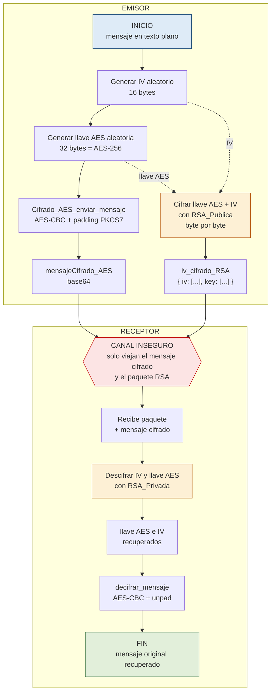

# Algoritmo Criptográfico Híbrido — AES-256 + RSA

Implementación de un sistema de cifrado híbrido que combina AES-256 en modo CBC para proteger el contenido de un mensaje, y RSA para proteger la llave simétrica durante su transmisión.

**Práctica 3 — Seguridad Informática**
Universidad Autónoma de Campeche, Facultad de Ingeniería
Alumno: Ángel Antonio Pérez Reyes
Docente: Sergio Noh Puch

---

## Tabla de contenido

- [Objetivo](#objetivo)
- [Instalación y uso](#instalación-y-uso)
- [Estructura del proyecto](#estructura-del-proyecto)
- [Funcionamiento del algoritmo híbrido](#funcionamiento-del-algoritmo-híbrido)
- [Diagrama de flujo](#diagrama-de-flujo)
- [Descripción de las funciones](#descripción-de-las-funciones)
- [Justificación de las decisiones de diseño](#justificación-de-las-decisiones-de-diseño)
- [Pruebas](#pruebas)
- [Análisis de seguridad](#análisis-de-seguridad)
- [Observaciones sobre las especificaciones](#observaciones-sobre-las-especificaciones)
- [Conclusiones](#conclusiones)

---

## Objetivo

Implementar un sistema criptográfico híbrido con tres funciones principales: `get_Msj_And_Key`, `decifrar_mensaje` y `Cifrado_AES_enviar_mensaje`. El componente RSA reutiliza la implementación desarrollada en la Práctica 2, con los parámetros `p = 67` y `q = 83`.

---

## Instalación y uso

### Requisitos

- Python 3.8 o superior
- PyCryptodome

```bash
pip install pycryptodome
```

> El paquete correcto es `pycryptodome`, no `pycrypto` ni `crypto`.

### Ejecución

```bash
# Demostración del ciclo completo
python main.py

# Batería de pruebas
python pruebas.py
```

---

## Estructura del proyecto

```
.
├── rsa_simple.py    # Llaves RSA y cifrado/descifrado de bytes (Práctica 2)
├── hibrido.py       # Las tres funciones del algoritmo híbrido
├── main.py          # Demostración del ciclo completo
├── pruebas.py       # Batería de pruebas
└── README.md
```

| Archivo | Responsabilidad |
|---|---|
| `rsa_simple.py` | Generación de llaves RSA y operaciones sobre secuencias de bytes |
| `hibrido.py` | Cifrado AES, empaquetado RSA y descifrado |
| `main.py` | Demostración emisor → canal → receptor |
| `pruebas.py` | Verificación del correcto funcionamiento |

---

## Funcionamiento del algoritmo híbrido

### El problema que resuelve

El cifrado simétrico y el asimétrico tienen fortalezas complementarias.

**AES es rápido.** Cifra grandes volúmenes de datos en microsegundos y opera sobre mensajes de cualquier longitud. Su limitación es de distribución: emisor y receptor deben compartir previamente la misma llave secreta, y entregar esa llave por un canal inseguro anula toda la protección.

**RSA resuelve exactamente ese problema.** El receptor publica una llave que cualquiera puede usar para cifrarle, mientras que solo él conserva la llave que descifra. Su limitación es de rendimiento y capacidad: las operaciones de exponenciación modular son órdenes de magnitud más lentas que AES, y RSA solo puede cifrar datos numéricamente menores que su módulo `n`.

**El esquema híbrido toma lo mejor de ambos:** AES cifra el mensaje, y RSA cifra únicamente la llave AES, que es un dato pequeño y de tamaño fijo. Este es el principio que sustenta TLS, PGP y prácticamente toda la comunicación cifrada moderna.

### Elementos del cifrado AES-CBC

| Elemento | Descripción |
|---|---|
| **Llave** | Secreto compartido de 32 bytes. Es el único elemento que debe permanecer confidencial. |
| **IV** | Valor aleatorio de 16 bytes que se combina con el primer bloque. Garantiza que cifrar dos veces el mismo texto produzca resultados distintos. No es secreto, pero sin él no se puede descifrar. |
| **Padding** | AES opera sobre bloques fijos de 16 bytes. PKCS#7 completa el último bloque y permite eliminar el relleno sin ambigüedad. |
| **CBC** | Cada bloque se combina mediante XOR con el bloque cifrado anterior. Propaga la aleatoriedad del IV a todo el mensaje. |

---

## Diagrama de flujo


```mermaid
flowchart TD
    subgraph EMISOR
        A["INICIO<br/>mensaje en texto plano"] --> B["Generar IV aleatorio<br/>16 bytes"]
        B --> C["Generar llave AES aleatoria<br/>32 bytes = AES-256"]
        C --> D["Cifrado_AES_enviar_mensaje<br/>AES-CBC + padding PKCS7"]
        D --> E["mensajeCifrado_AES<br/>base64"]
        C -.llave AES.-> F
        B -.IV.-> F
        F["Cifrar llave AES + IV<br/>con RSA_Publica<br/>byte por byte"] --> G["iv_cifrado_RSA<br/>{ iv: [...], key: [...] }"]
    end

    E --> H
    G --> H

    H{{"CANAL INSEGURO<br/>solo viajan el mensaje cifrado<br/>y el paquete RSA"}}

    subgraph RECEPTOR
        H --> I["Recibe paquete<br/>+ mensaje cifrado"]
        I --> J["Descifrar IV y llave AES<br/>con RSA_Privada"]
        J --> K["llave AES e IV<br/>recuperados"]
        K --> L["decifrar_mensaje<br/>AES-CBC + unpad"]
        L --> M["FIN<br/>mensaje original recuperado"]
    end

    style A fill:#deebf7,stroke:#1f4e79
    style M fill:#e2efda,stroke:#2e6930
    style F fill:#fdf0d5,stroke:#b45309
    style J fill:#fdf0d5,stroke:#b45309
    style H fill:#fce4e4,stroke:#c00000
```

> **Simétrico (AES):** cifra el mensaje — **Asimétrico (RSA):** protege la llave

Si el diagrama no se renderiza, está también como imagen: [`diagrama_flujo.png`](diagrama_flujo.png)

---

## Descripción de las funciones

### `Cifrado_AES_enviar_mensaje(mensaje, iv, key=None)`

Función auxiliar que realiza el cifrado simétrico. Recibe el mensaje en texto plano y el IV que debe utilizarse. Si no se proporciona llave, genera una de 32 bytes con un generador criptográficamente seguro.

Aplica padding PKCS#7 al mensaje codificado en UTF-8, lo cifra con AES-CBC y devuelve la llave utilizada junto con el resultado en base64.

> El parámetro opcional `key` se añadió para que la función opere tanto de forma autónoma como invocada desde `get_Msj_And_Key`, sin alterar la firma de dos argumentos del enunciado.

### `get_Msj_And_Key(RSA_Publica, mensaje)`

Lado del **emisor**. Ejecuta la secuencia completa:

1. Genera un IV aleatorio de 16 bytes
2. Genera una llave AES aleatoria de 32 bytes y cifra el mensaje
3. Cifra la llave AES y el IV con la llave pública RSA del receptor
4. Devuelve el paquete RSA y el mensaje cifrado

El valor `iv_cifrado_RSA` es un diccionario que contiene tanto el IV como la llave AES cifrados. El enunciado contempla esta alternativa al indicar que el IV puede empaquetarse junto con la clave cifrada. **Sin este empaquetado la llave AES no tendría forma de llegar al receptor y el descifrado sería imposible.**

### `decifrar_mensaje(mensajeCifrado_AES, iv_cifrado_RSA, RSA_Privada)`

Lado del **receptor**. Recupera el IV y la llave AES aplicando la llave privada RSA sobre el paquete recibido, reconstruye el objeto AES-CBC y descifra el mensaje, eliminando el padding para devolver el texto plano original.

---

## Justificación de las decisiones de diseño

| Decisión | Valor | Justificación |
|---|---|---|
| Tamaño de llave AES | 32 bytes (256 bits) | AES-256 es la variante más robusta del estándar y la recomendada por NIST para información sensible a largo plazo. AES admite únicamente 16, 24 o 32 bytes. |
| Tamaño del IV | 16 bytes | El IV debe medir exactamente lo mismo que el bloque de AES (128 bits). Cualquier otro valor genera un error de ejecución. |
| Modo de operación | CBC | Encadena los bloques, por lo que patrones repetidos en el texto plano no producen patrones visibles en el cifrado. El modo ECB carece de esta propiedad y no debe usarse. |
| Padding | PKCS#7 | Esquema estándar, no ambiguo y soportado de forma nativa por PyCryptodome. |
| Codificación de salida | base64 | AES produce bytes arbitrarios no representables como texto. Base64 los convierte en caracteres imprimibles, aptos para JSON o transmisión textual. |
| Cifrado RSA de la llave | byte por byte | Con `p=67` y `q=83` se obtiene `n=5561`. RSA solo cifra valores menores que `n`; como cada byte está en el rango 0–255 y 255 < 5561, la única forma de proteger los 32 bytes con este módulo es procesarlos individualmente. |
| Empaquetado de IV y llave | diccionario | Las firmas del enunciado no contemplan un canal para transmitir la llave AES cifrada. |

---

## Pruebas

Ejecutar con:

```bash
python pruebas.py
```

### Qué se verifica

| Prueba | Qué comprueba |
|---|---|
| Ciclo completo | Un mensaje cifrado por el emisor es recuperado íntegro por el receptor |
| Longitudes variables | Mensajes de 1, 4, 16, 32 y 100 caracteres, incluyendo los que no son múltiplo del bloque |
| No determinismo | El mismo mensaje cifrado dos veces produce cifrados distintos, gracias al IV aleatorio |
| Tamaños correctos | El IV recuperado mide 16 bytes y la llave AES 32 bytes |
| Llave incorrecta | Una llave privada RSA distinta no permite descifrar |
| Mensaje alterado | Modificar el texto cifrado impide recuperar el original |
| Función auxiliar | `Cifrado_AES_enviar_mensaje` opera con un IV proporcionado externamente |

### Salida de la ejecución

```text
==============================================================
PRUEBAS DEL ALGORITMO HIBRIDO
==============================================================
Clave publica  (e, n) = (17, 5561)
Clave privada  (d, n) = (4457, 5561)

[PASA] Ciclo completo cifrado/descifrado  -> Mensaje secreto de Angel Perez

[PASA] Longitud: 1 caracter (1 chars)
[PASA] Longitud: menor a un bloque (4 chars)
[PASA] Longitud: exacto 16 bytes (16 chars)
[PASA] Longitud: mayor a un bloque (100 chars)
[PASA] Longitud: con acentos UTF-8 (32 chars)

[PASA] El mismo texto produce cifrados distintos (IV aleatorio)

[PASA] IV mide 16 bytes (tamano de bloque AES)  -> 16 bytes
[PASA] Llave AES mide 32 bytes (AES-256)  -> 32 bytes

[PASA] Llave privada incorrecta no descifra  -> ValueError

[PASA] Mensaje alterado no devuelve el original  -> ValueError

[PASA] Cifrado_AES_enviar_mensaje con IV externo  -> SHJFJYXo4kvRFPAEVsZQwg==
[PASA] Genera llave de 32 bytes si no se proporciona

==============================================================
RESULTADO: 13/13 pruebas superadas
==============================================================
```

---

## Análisis de seguridad

El sistema funciona correctamente como demostración académica, pero presenta debilidades graves. Conviene distinguir con precisión qué parte del sistema es sólida y cuál no.

### Lo que sí está bien resuelto

- El uso de **AES-256 en modo CBC con IV aleatorio por mensaje** es una construcción correcta. Un atacante que capture únicamente el mensaje cifrado no obtiene información sobre el texto plano.
- El IV se genera con `get_random_bytes`, que utiliza el **generador criptográficamente seguro del sistema operativo**. Esto garantiza la propiedad de no determinismo verificada en las pruebas.
- La **arquitectura híbrida** en sí misma es correcta y corresponde al modelo empleado por protocolos reales.

### Debilidad crítica: el tamaño del módulo RSA

Con `p = 67` y `q = 83` se obtiene `n = 5561`, un módulo de apenas **13 bits**. RSA es seguro porque factorizar el producto de dos primos grandes es computacionalmente inviable; con números de dos cifras esa factorización es inmediata. Cualquier atacante recupera `p` y `q` por fuerza bruta en milisegundos, calcula φ(n) y deriva la llave privada `d` a partir de la pública. Los estándares actuales exigen módulos de **2048 bits** como mínimo.

### Debilidad crítica: el cifrado byte por byte

Esta es la falla más severa, y es consecuencia directa de la anterior. Como `n` solo admite valores menores a 5561, la llave AES de 32 bytes no puede cifrarse en una sola operación y debe procesarse byte por byte.

El resultado es que **RSA deja de comportarse como un cifrado asimétrico y se degrada a un cifrado por sustitución monoalfabética**. Existen únicamente 256 valores posibles de entrada, y como no se aplica relleno, el mismo byte produce siempre el mismo número cifrado. Un atacante que conozca la llave pública —que es pública por definición— construye la tabla completa de correspondencias en 256 operaciones y recupera la llave AES íntegra **sin necesidad de factorizar nada**.

> El AES está bien implementado, pero la protección de su llave es el eslabón que rompe todo el esquema. La seguridad de un sistema criptográfico está determinada por su componente más débil, no por el más fuerte.

### Ausencia de relleno probabilístico en RSA

La implementación utiliza RSA en su forma pura (*textbook RSA*). Sin un esquema de relleno como **OAEP**, el cifrado es determinista y por tanto vulnerable a ataques de texto plano elegido. Una implementación real cifraría los 32 bytes de la llave AES en una sola operación protegida con OAEP.

### Ausencia de autenticación

El sistema garantiza **confidencialidad, pero no integridad ni autenticidad**. Un atacante que intercepte el mensaje puede modificar bytes del texto cifrado, y el receptor no tiene forma de detectarlo más allá de un eventual error de padding. El modo CBC es además susceptible a ataques de tipo *padding oracle*. Una solución completa emplearía un modo autenticado como **GCM**, o añadiría un **HMAC** sobre el texto cifrado.

### Resumen

| Componente | Evaluación |
|---|---|
| Cifrado AES-256-CBC del mensaje | ✅ Correcto y seguro |
| Generación de IV y llave | ✅ Usa generador criptográficamente seguro |
| Arquitectura híbrida | ✅ Conceptualmente correcta |
| Tamaño del módulo RSA (13 bits) | ❌ Inseguro, solo apto para fines didácticos |
| Cifrado RSA byte por byte | ❌ Equivale a una sustitución monoalfabética |
| Relleno RSA (OAEP) | ❌ Ausente |
| Autenticación e integridad | ❌ Ausente |

---

## Observaciones sobre las especificaciones

Durante la implementación se identificaron dos puntos del enunciado que requirieron ajuste.

### Tamaño del IV

El enunciado indica generar un IV de 32 bytes. En AES el vector de inicialización debe medir exactamente lo mismo que el bloque, es decir **16 bytes**, sin importar el tamaño de la llave. Utilizar 32 bytes provoca un error de ejecución. La implementación emplea 16 bytes para el IV; la llave AES sí se mantiene en los 32 bytes especificados.

### Transmisión de la llave AES

Las firmas indicadas no incluyen un canal para que la llave AES cifrada llegue al receptor: `get_Msj_And_Key` devuelve únicamente el IV cifrado y el mensaje, mientras que `decifrar_mensaje` necesita la llave para operar. El enunciado contempla implícitamente esta situación al permitir empaquetar el IV junto con la clave cifrada, y esa es la solución adoptada.

---

## Conclusiones

El sistema implementa correctamente el esquema híbrido solicitado y demuestra el ciclo completo de cifrado y descifrado entre dos partes. Las 13 pruebas ejecutadas se superaron satisfactoriamente.

El valor principal de la práctica no reside únicamente en que el código funcione, sino en **evidenciar por qué los parámetros criptográficos no son arbitrarios**. Un RSA de 13 bits obliga a cifrar la llave byte por byte, y esa concesión aparentemente técnica destruye por completo la seguridad del sistema, a pesar de que el componente AES esté correctamente implementado.

Esto ilustra un principio central de la seguridad informática: **un sistema no es tan fuerte como su mejor componente, sino tan débil como el más frágil de sus eslabones.** Escalar el módulo RSA a 2048 bits y aplicar relleno OAEP permitiría cifrar la llave AES en una sola operación y convertiría este mismo diseño en un esquema equivalente al que emplean los protocolos de comunicación segura actuales.
