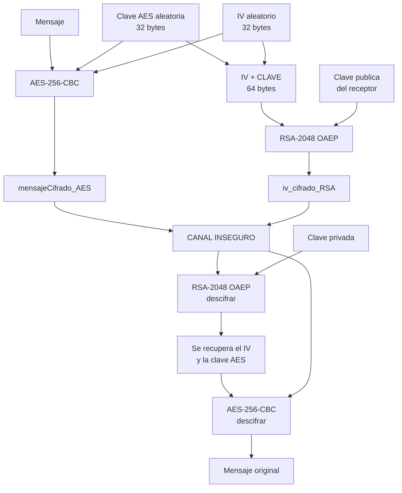
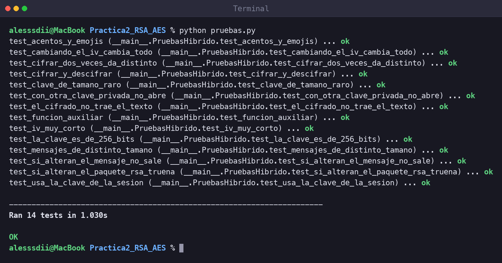
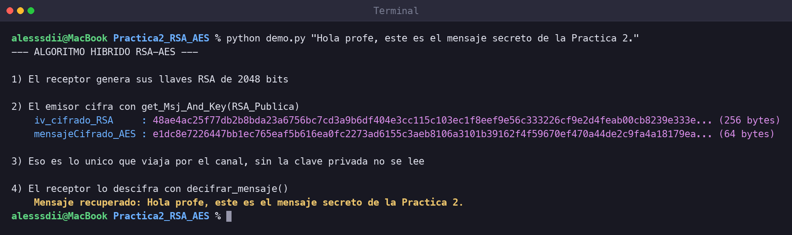

# Práctica 2 - Algoritmo Híbrido RSA + AES

Seguridad Informática, Facultad de Ingeniería (UACAM).

## De qué se trata

Un cifrado híbrido junta los dos tipos de criptografía para aprovechar lo bueno
de cada uno:

* **AES** es rapidísimo y puede cifrar mensajes de cualquier tamaño, pero tiene
  el problema de que el emisor y el receptor necesitan ponerse de acuerdo en una
  clave secreta, y pasársela por un canal inseguro es justamente el problema que
  queríamos resolver.
* **RSA** no tiene ese problema porque la clave pública la puede conocer
  cualquiera, pero es lentísimo y sólo puede cifrar datos muy chicos (con
  RSA-2048 y OAEP el límite son 190 bytes).

Entonces la solución es usar AES para el mensaje y RSA nada más para la clave
AES y el IV, que son 64 bytes. Así es como funcionan HTTPS y PGP en realidad.

## Cómo correrlo

```bash
pip install -r requirements.txt
python demo.py "Mi mensaje secreto"
python pruebas.py
```

Si le corres `demo.py` sin argumento te pide el mensaje por teclado.

## Las tres funciones

### `get_Msj_And_Key(RSA_Publica)`

Es el lado del emisor. Recibe la clave pública del receptor y hace esto:

1. Genera una clave AES aleatoria de 32 bytes.
2. Genera un IV aleatorio de 32 bytes.
3. Cifra el mensaje con AES en modo CBC con esa clave y ese IV.
4. Cifra la clave AES con RSA usando la pública del receptor.
5. El IV se manda junto con la clave en ese mismo cifrado RSA.

Regresa `iv_cifrado_RSA` y `mensajeCifrado_AES`.

Los pasos 4 y 5 los junté en una sola operación RSA, o sea que en lugar de
cifrar la clave por un lado y el IV por otro, los pego y cifro los 64 bytes de
un jalón:

```
iv_cifrado_RSA = RSA_OAEP( IV (32 bytes) + CLAVE (32 bytes) )
```

Lo hice así porque la práctica dice "o empaquetarlo junto con la clave cifrada",
y porque si no, `decifrar_mensaje` no tendría de dónde sacar la clave AES: sólo
recibe dos criptogramas y la clave privada.

### `decifrar_mensaje(mensajeCifrado_AES, iv_cifrado_RSA, RSA_Privada)`

El lado del receptor. Abre el paquete RSA con su clave privada, separa los
primeros 32 bytes (el IV) de los últimos 32 (la clave AES) y con eso ya descifra
el mensaje y le quita el relleno. Regresa el texto original.

### `Cifrado_AES_enviar_mensaje("Mensaje", iv)`

La función auxiliar, cifra con AES-CBC usando el IV que se le pase. Como la
firma que pide la práctica no trae la clave por ningún lado, la saca de la
variable `clave_actual` del módulo, que es donde `get_Msj_And_Key` deja la clave
que generó. También se le puede pasar directo con `clave=...`.

## Diagrama del proceso


```mermaid
flowchart TD
    A[Mensaje] --> B[AES-256-CBC]
    K[Clave AES aleatoria<br>32 bytes] --> B
    V[IV aleatorio<br>32 bytes] --> B
    B --> C[mensajeCifrado_AES]

    K --> P[IV + CLAVE<br>64 bytes]
    V --> P
    P --> D[RSA-2048 OAEP]
    PUB[Clave publica<br>del receptor] --> D
    D --> E[iv_cifrado_RSA]

    C --> CANAL[CANAL INSEGURO]
    E --> CANAL

    CANAL --> F[RSA-2048 OAEP<br>descifrar]
    PRIV[Clave privada] --> F
    F --> G[Se recupera el IV<br>y la clave AES]
    G --> H[AES-256-CBC<br>descifrar]
    CANAL --> H
    H --> I[Mensaje original]
```

## Por qué elegí cada cosa

**Clave AES de 256 bits.** Es lo que pide la práctica y además es lo más seguro
que hay en AES. Son 2^256 combinaciones posibles, o sea que por fuerza bruta no
se saca ni de broma. Otra ventaja es que aguanta mejor el ataque de Grover, que
es el algoritmo cuántico que le baja la seguridad a la mitad: 256 bits se
quedarían en 128, que sigue siendo seguro.

**Modo CBC.** También lo pide la práctica. Lo importante de CBC es que cada
bloque se combina con el cifrado del bloque anterior antes de cifrarse, entonces
dos bloques iguales en el texto original salen distintos. Si se usara ECB no
pasaría eso y se alcanzarían a ver los patrones del mensaje (el ejemplo típico
es la imagen del pingüino de Linux cifrada con ECB, donde todavía se ve el
pingüino).

**Relleno PKCS#7.** CBC nada más cifra bloques completos de 16 bytes, así que si
el mensaje no es múltiplo de 16 hay que rellenarlo. PKCS#7 rellena con bytes que
indican cuántos son, así que al descifrar se sabe exactamente cuántos quitar.
Cuando el mensaje ya es múltiplo de 16 agrega un bloque entero de relleno, si no
no habría forma de saber si los últimos bytes eran relleno o parte del mensaje.

**IV de 32 bytes.** Aquí hay un detalle: la práctica pide generar 32 bytes, pero
AES-CBC necesita un IV de exactamente 16, que es el tamaño de bloque. Lo que
hice fue generar los 32 como dice el enunciado (y los 32 viajan cifrados dentro
del RSA), pero al cifrador nada más le paso los primeros 16 con `iv[:16]`. Los
otros 16 quedan sin usarse.

**IV nuevo en cada mensaje.** Si se repitiera el IV con la misma clave se podría
saber si dos mensajes empiezan igual. Generándolo aleatorio cada vez, el mismo
texto sale distinto cada vez que se cifra (eso lo comprueba una de las pruebas).

**RSA de 2048 bits.** Es el mínimo que recomienda el NIST hoy en día. Los de
1024 ya se consideran rotos. Se podría usar 4096 pero se vuelve bastante más
lento y para esta práctica no hace falta.

**OAEP en lugar de PKCS#1 v1.5.** RSA "pelón" (sin relleno) es determinista, o
sea que el mismo dato siempre da el mismo criptograma, y eso es un problema.
PKCS#1 v1.5 mete relleno pero es vulnerable al ataque de Bleichenbacher. OAEP es
el que se recomienda actualmente.

**Aleatoriedad con `get_random_bytes`.** Usa el generador del sistema operativo,
que sí es criptográficamente seguro. Con el módulo `random` de Python no
serviría porque es predecible si alguien alcanza a ver suficientes salidas.

**Librería pycryptodome.** No hay que implementar AES ni RSA a mano, siempre
sale mal y se abren agujeros de seguridad. Mejor usar una librería ya revisada.

## Pruebas

Hice 14 pruebas con `unittest`. Lo que revisan:

* Que el mensaje descifrado sea igual al original.
* Mensajes de varios tamaños, incluyendo el vacío, uno de 16 bytes justos y uno
  de 1000, que son los casos donde se puede romper el relleno.
* Que funcione con acentos, ñ y emojis (UTF-8).
* Que el texto original no aparezca dentro del criptograma.
* Que cifrar dos veces lo mismo dé resultados distintos.
* Que la clave que se genera sea de 32 bytes.
* Que con otra clave privada no se pueda abrir el mensaje.
* Que si alguien altera el criptograma AES ya no salga el mensaje original.
* Que si alteran el paquete RSA, OAEP lo detecte y truene.
* Que la función auxiliar funcione con una clave y un IV dados.
* Que al cambiar el IV cambie todo el criptograma.
* Que truene si el IV o la clave son de un tamaño inválido.
* Que la función auxiliar agarre la clave de la sesión si no se le pasa una.



Y así se ve el flujo completo corriendo:



En la captura se alcanza a ver que `iv_cifrado_RSA` mide 256 bytes, que es el
tamaño fijo de salida de RSA-2048 aunque adentro nada más vayan 64 bytes útiles,
y que el mensaje cifrado mide 64 bytes para un mensaje de 56 caracteres, porque
el relleno lo sube al siguiente múltiplo de 16. Los valores hexadecimales salen
diferentes cada vez que se corre.

## Análisis de seguridad

### Lo que sí protege

El mensaje va confidencial. Para leerlo habría que romper AES-256 o factorizar
un RSA de 2048 bits, y ninguna de las dos se puede hacer hoy. La clave AES nunca
viaja en claro y sólo la puede sacar quien tenga la clave privada. Además, como
cada mensaje usa una clave y un IV nuevos, si alguien llegara a sacar la clave
de un mensaje no le serviría para los demás.

### Lo que no protege

**1. No hay integridad ni autenticidad.** Esta es la falla más importante. CBC
es maleable: si un atacante cambia bits de un bloque, puede provocar cambios
controlados en el bloque siguiente del texto descifrado. El receptor no tiene
forma de saber si el mensaje que le llegó es el que se mandó. Se arregla usando
AES-GCM, que además de cifrar autentica, o agregando un HMAC-SHA256 sobre el
criptograma (primero cifrar y luego calcular el MAC, en ese orden).

**2. Padding oracle.** Va de la mano con lo anterior. Si el sistema deja ver la
diferencia entre "el relleno está mal" y cualquier otro error, aunque sea por el
tiempo que tarda en responder, un atacante puede ir descifrando el mensaje byte
por byte sin tener la clave. Es el ataque de Vaudenay. La solución es la misma:
verificar un MAC antes de intentar descifrar.

**3. No se sabe quién mandó el mensaje.** Como la clave pública la tiene
cualquiera, cualquiera puede mandar un mensaje haciéndose pasar por otro.
Tampoco hay no repudio, el emisor puede negar que lo mandó. Faltaría una firma
digital del emisor.

**4. Man in the middle al repartir la clave pública.** Todo el esquema depende de
que la clave pública que usa el emisor sea de verdad la del receptor. Si un
atacante logra sustituirla por la suya, puede descifrar todo, volverlo a cifrar
con la clave real y reenviarlo sin que nadie se entere. Por eso existen los
certificados y las autoridades certificadoras.

**5. No hay forward secrecy.** Si algún día se filtra la clave privada RSA, todo
lo que el atacante haya interceptado y guardado antes se vuelve legible. Se
resuelve con intercambio de claves efímero tipo ECDHE en vez de cifrar la clave
con RSA.

**6. Se puede reenviar un mensaje viejo.** Nada impide que un atacante capture
un par de criptogramas y los vuelva a mandar después; el receptor los va a
aceptar como si fueran nuevos. Habría que meter una marca de tiempo o un
contador dentro del mensaje.

**7. La clave AES se queda en una variable del módulo.** Eso fue para poder
respetar la firma `Cifrado_AES_enviar_mensaje("Mensaje", iv)` que pide la
práctica. La clave se queda en memoria y no se borra, y si el programa usara
varios hilos se podrían pisar las claves entre sí. Lo correcto sería pasarla
como parámetro, que de hecho también se puede.

**8. La clave privada en disco.** Si se guarda con `guardar_llaves()` queda en
un archivo sin proteger. Cualquiera que lo lea rompe todo el sistema. Se debería
exportar con contraseña y con permisos restringidos.

### Conclusión

Como práctica cumple con lo que se pedía y demuestra bien por qué se usan
esquemas híbridos: RSA resuelve el problema de repartir la clave que AES
necesita. Pero confidencialidad no es lo mismo que seguridad. Para que esto
sirviera de verdad le faltarían dos cosas: cifrado autenticado (AES-GCM o un
HMAC) y firmas digitales para saber quién mandó qué.

## Archivos

| Archivo | Qué es |
|---|---|
| `hibrido_rsa_aes.py` | El algoritmo, las tres funciones |
| `demo.py` | Demostración del flujo completo |
| `pruebas.py` | Las 14 pruebas |
| `capturas/` | Capturas de las corridas |
| `requirements.txt` | La dependencia (pycryptodome) |
