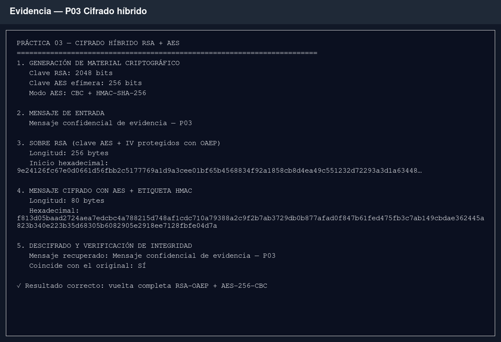

# Resultados — Práctica 03: cifrado híbrido RSA + AES

## Ejecución

La demostración generó una clave RSA de 2048 bits y una clave AES efímera de
256 bits. La clave AES y el IV se protegieron mediante RSA-OAEP, mientras que el
mensaje se cifró con AES-CBC y se autenticó con HMAC-SHA-256.

Después de abrir el sobre RSA, verificar la integridad y descifrar el
criptograma, el sistema recuperó exactamente el mensaje original.



*Captura 1. Generación de claves, creación del sobre RSA, cifrado AES con HMAC y
recuperación del texto original.*

## Verificación

Se ejecutó la suite completa del proyecto:

```bash
python -m unittest discover -v
```

Resultado: **13 pruebas correctas**. La suite cubre claves PEM, Unicode,
aleatoriedad, mensaje vacío, alteración del criptograma y del sobre RSA, uso de
una clave privada incorrecta, validación de tamaños y las operaciones RSA
didácticas.
