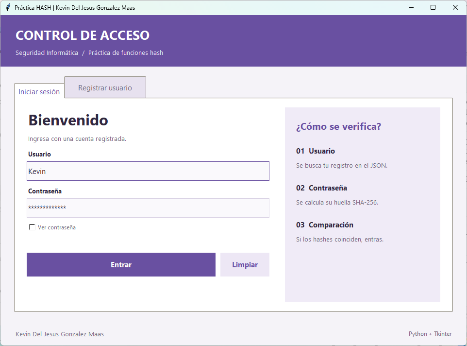
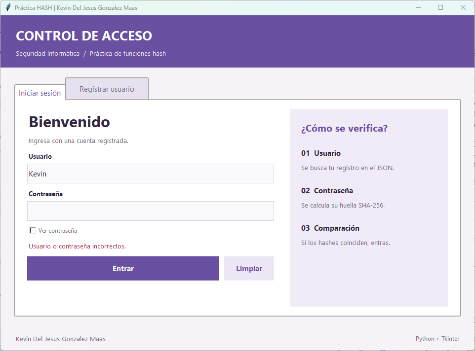
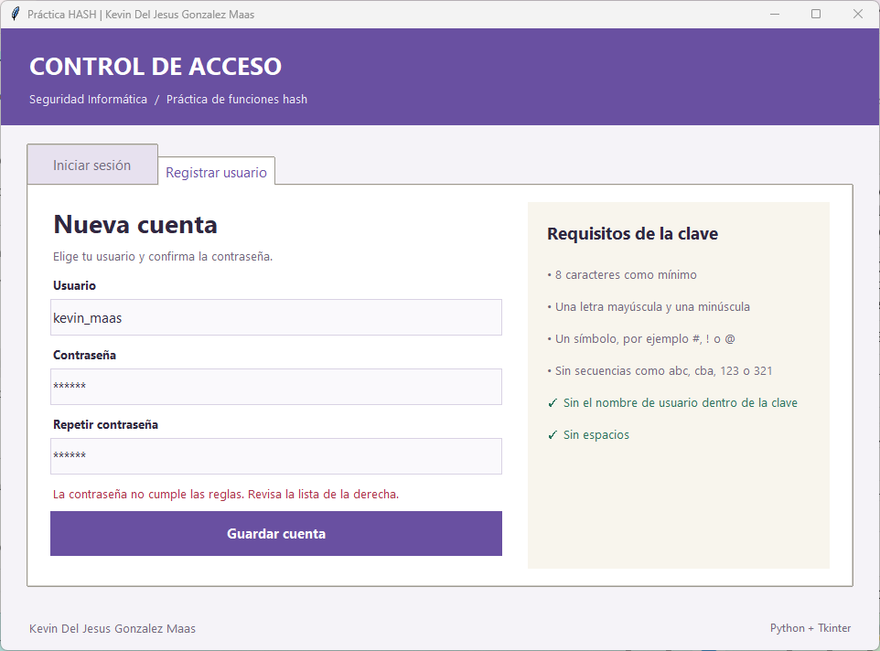
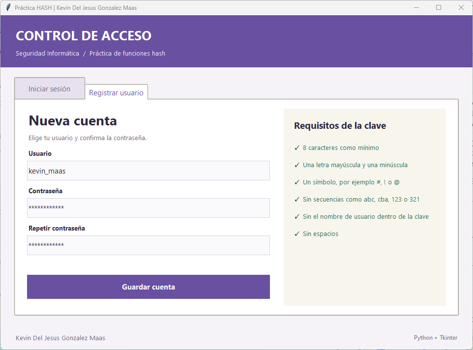
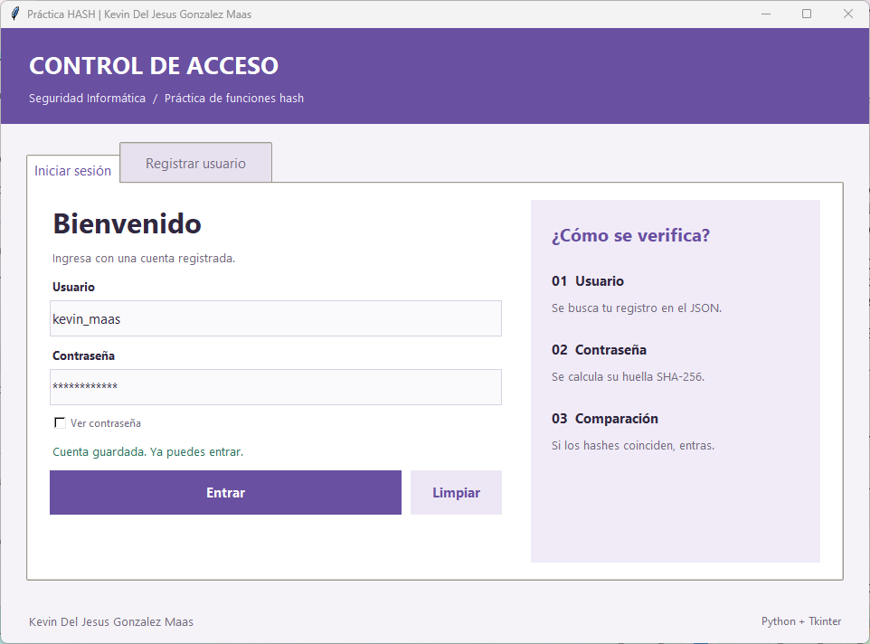
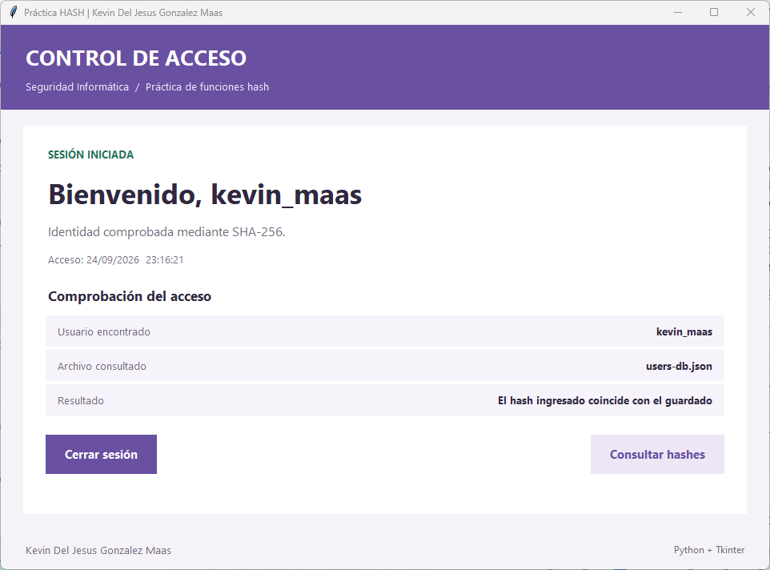
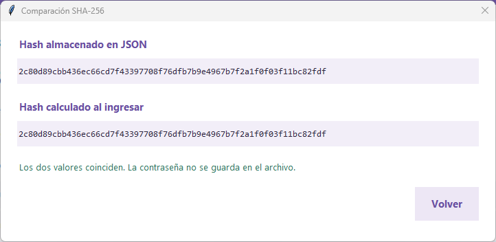
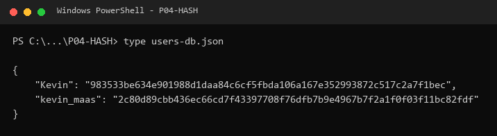

<p align="center">
  
</p>

<h1 align="center">🧾 Control de acceso con funciones HASH (SHA-256)</h1>

<p align="center">
  <strong>Práctica 4 — Seguridad Informática</strong><br>
  Facultad de Ingeniería · Universidad Autónoma de Campeche (UACAM)
</p>

<p align="center">
  
  
  
  
  
</p>

---

## 📋 Descripción

Esta práctica es una **aplicación de escritorio de control de acceso** (registro e inicio de sesión)
donde las contraseñas **nunca se guardan en texto plano**: lo único que se almacena es su huella
**SHA-256**.

La idea que quise demostrar es la propiedad clave de una función hash:

> Es fácil calcular `hash(contraseña)`, pero a partir del hash **no se puede regresar** a la
> contraseña. Por eso el sistema puede verificar quién eres sin saber cuál es tu contraseña.

Cuando alguien intenta entrar, el programa **no compara contraseñas**: calcula el SHA-256 de lo que
se escribió y lo compara contra el hash guardado en el archivo JSON. Si los 64 caracteres
hexadecimales coinciden, se concede el acceso.

| Elemento | Implementación |
|----------|----------------|
| Función hash | **SHA-256** (`hashlib.sha256`) |
| Almacenamiento | Archivo `users-db.json` con pares `usuario: hash` |
| Comparación | `hmac.compare_digest()` (tiempo constante) |
| Interfaz | **Tkinter + ttk** (solo librería estándar) |

---

## ✨ Qué hace el programa

- 🆕 **Registro de usuarios** con validación de la contraseña en vivo: cada requisito se pone en
  verde con un ✓ conforme lo vas cumpliendo.
- 🔐 **Inicio de sesión** verificando la huella SHA-256 contra el archivo JSON.
- 👁️ **Ver contraseña** para comprobar lo que se escribió.
- 🧾 **Pantalla de comprobación** que muestra lado a lado el *hash almacenado* y el *hash calculado*,
  para que se vea que son idénticos.
- 💾 **Escritura segura del JSON**: se escribe primero en un archivo temporal y luego se reemplaza
  el original (`os.replace`), así el registro no se corrompe si algo falla a medias.
- 🛡️ **Validación del JSON al leerlo**: se revisa que cada usuario tenga el formato correcto y que
  cada hash sean exactamente 64 caracteres hexadecimales.

### Reglas que debe cumplir una contraseña

| # | Regla |
|---|-------|
| 1 | 8 caracteres como mínimo |
| 2 | Una letra mayúscula y una minúscula |
| 3 | Un símbolo, por ejemplo `#`, `!` o `@` |
| 4 | Sin secuencias como `abc`, `cba`, `123` o `321` |
| 5 | Sin el nombre de usuario dentro de la clave |
| 6 | Sin espacios |

---

## 🛠️ Requisitos previos

| Herramienta | Versión mínima | Nota |
|-------------|----------------|------|
| 🐍 **Python** | 3.8 o superior | — |
| 🖼️ **Tkinter** | Incluido con Python | En Windows y macOS ya viene. En Linux: `sudo apt install python3-tk` |

No hay que instalar ninguna librería externa: **todo es librería estándar**.

---

## 🚀 Cómo ejecutarlo

```bash
git clone https://github.com/KevinUac/SeguridadInformatica.git
cd SeguridadInformatica/P04-HASH
python main.py
```

> [!NOTE]
> En Windows, si `python` no es reconocido, usa `py main.py`.
> En Linux o macOS puede ser `python3 main.py`.

> [!IMPORTANT]
> Hay que ejecutarlo **desde la carpeta `P04-HASH`**, porque `main.py` importa el paquete `utils`.
> El archivo `users-db.json` se localiza solo (la ruta se calcula con `pathlib` a partir de la
> ubicación del código), así que no importa desde qué disco se corra.

---

## 📂 Estructura del proyecto

```
P04-HASH/
│
├── 🐍 main.py                 # Punto de entrada: abre la ventana
├── 🗄️ users-db.json           # "Base de datos": usuario -> hash SHA-256
├── 📄 INSTRUCTIONS.MD         # Enunciado de la práctica
├── 🖼️ capturas/               # Evidencias de la ejecución
├── 📖 README.md               # Este archivo
│
└── 📦 utils/
    ├── __init__.py
    ├── cuentas.py             # Hash, reglas de la contraseña, registro y verificación
    ├── archivo_json.py        # Lectura y escritura segura del JSON
    └── ventanas.py            # Interfaz gráfica (Tkinter + ttk)
```

### Por qué lo separé así

Dividí el programa en tres módulos para que cada uno tenga una sola responsabilidad y se pueda
revisar por separado:

| Módulo | Responsabilidad |
|--------|-----------------|
| `cuentas.py` | Toda la **lógica de seguridad**: calcular el SHA-256, validar las reglas, registrar y comprobar credenciales. No sabe nada de ventanas. |
| `archivo_json.py` | **Persistencia**: leer y guardar el diccionario `usuario: hash`, validando el formato. |
| `ventanas.py` | Solo la **interfaz**. No calcula hashes: se los pide a `cuentas.py`. |

---

## ⚙️ Funciones principales

### 🔑 `sha256(texto)` — `utils/cuentas.py`

```python
def sha256(texto):
    return hashlib.sha256(texto.encode("utf-8")).hexdigest()
```

Convierte la contraseña a bytes y devuelve su huella de **64 caracteres hexadecimales**.

---

### 📝 `registrar(usuario, clave, repeticion)`

Valida el nombre de usuario, comprueba las seis reglas, verifica que la confirmación coincida,
revisa que el usuario no exista ya y **guarda únicamente el hash**.

---

### 🔓 `comprobar(usuario, clave)`

```python
calculado = sha256(clave)
almacenado = datos[nombre] if nombre is not None else "0" * 64
coincide = hmac.compare_digest(almacenado, calculado)
```

Dos detalles que cuidé aquí:

1. **`hmac.compare_digest()` en vez de `==`.** La comparación normal se detiene en el primer
   carácter distinto, y midiendo ese tiempo se puede ir adivinando el hash carácter por carácter
   (*ataque de temporización*). `compare_digest` siempre tarda lo mismo.
2. **Si el usuario no existe, igual se compara** contra un hash falso de 64 ceros. Así el programa
   tarda lo mismo con un usuario inexistente que con uno real, y no se puede deducir **qué usuarios
   están registrados** midiendo la respuesta.

---

## 🖼️ Evidencia de la ejecución

**Captura 1.** Pantalla de inicio de sesión. A la derecha se explican los tres pasos de la
verificación: se busca el usuario en el JSON, se calcula el SHA-256 de la contraseña y se comparan
los hashes.



**Captura 2.** Intento de acceso con la contraseña equivocada. El hash calculado no coincide con el
almacenado, así que se rechaza el acceso. El aviso es genérico ("Usuario o contraseña incorrectos")
a propósito: no se le dice al atacante cuál de los dos datos falló.



**Captura 3.** Registro rechazado. La contraseña `abc123` no cumple: es muy corta, no tiene
mayúscula, no tiene símbolo y además contiene secuencias (`abc` y `123`). En la lista de la derecha
se ve exactamente cuáles reglas faltan.



**Captura 4.** Ahora sí, con una contraseña válida las seis reglas se marcan en verde con ✓. La
validación se actualiza en vivo mientras se escribe, usando `trace_add("write", ...)` sobre las
variables de los campos.



**Captura 5.** Cuenta guardada. El programa regresa a la pestaña de inicio de sesión con el usuario
ya escrito y el aviso de confirmación en verde.



**Captura 6.** Acceso concedido. Se muestra la fecha y hora del ingreso y el detalle de la
comprobación: usuario encontrado, archivo consultado y resultado de la comparación de hashes.



**Captura 7.** Botón *Consultar hashes*: aquí está la prueba de la práctica. El **hash almacenado
en el JSON** y el **hash calculado al ingresar** son exactamente el mismo valor de 64 caracteres, y
en ningún momento la contraseña estuvo guardada en el archivo.



**Captura 8.** Contenido del archivo de registro al terminar la demostración. Lo único que hay por
usuario es su huella SHA-256: **no aparece ninguna contraseña por ningún lado**.



> Las cuentas que se ven en las capturas son de demostración y la corrida se hizo sobre una copia
> del `users-db.json`, para no alterar el registro que viene en el repositorio.

---

## 🔬 Qué se demuestra con esto

| Propiedad de las funciones hash | Cómo se ve en la práctica |
|----------------------------------|---------------------------|
| **Unidireccionalidad** | En el JSON solo hay hashes. Aunque alguien se robe el archivo, no obtiene las contraseñas. |
| **Longitud fija** | Da igual si la contraseña tiene 8 o 1000 caracteres: el hash siempre mide 64 caracteres hexadecimales (256 bits). |
| **Determinismo** | La misma contraseña siempre produce el mismo hash; por eso el login funciona (Captura 7). |
| **Efecto avalancha** | Cambiando un solo carácter de la contraseña, el hash sale completamente distinto y el acceso se rechaza (Captura 2). |

---

## 🛡️ Análisis de seguridad

### Lo que sí hace bien

- La contraseña **no se guarda nunca**, ni en el archivo ni en memoria más tiempo del necesario:
  después de cada intento el campo se limpia (`self.acceso_clave.set("")`).
- Comparación en **tiempo constante** y respuesta uniforme para usuario inexistente.
- **Mensajes de error genéricos** en el inicio de sesión, para no filtrar qué usuarios existen.
- **Política de contraseñas** que bloquea las claves más típicas de los ataques de diccionario
  (cortas, sin símbolos, con secuencias o con el propio nombre de usuario dentro).
- **Escritura atómica** del JSON y **validación del formato** al leerlo, para que un archivo
  manipulado no reviente el programa ni meta datos raros.

### Limitaciones que reconozco

| Limitación | Por qué importa | Cómo se resolvería |
|------------|-----------------|--------------------|
| **SHA-256 sin sal** | Dos usuarios con la misma contraseña quedan con el mismo hash, y ese hash se puede buscar en tablas *rainbow* ya publicadas. | Añadir una **sal aleatoria** por usuario y guardarla junto al hash. |
| **SHA-256 es demasiado rápido** | Justo lo que lo hace bueno para verificar integridad lo hace malo para contraseñas: una GPU prueba miles de millones por segundo. | Usar una función **lenta y con costo configurable**: `bcrypt`, `scrypt`, **Argon2** o `hashlib.pbkdf2_hmac`. |
| **No hay límite de intentos** | Se puede automatizar la prueba de contraseñas contra la aplicación. | Bloqueo temporal tras N intentos fallidos. |
| **El JSON está en texto plano junto al programa** | Cualquiera con acceso al equipo lo puede copiar. | Base de datos con permisos, o cifrado del archivo. |

> Para los fines de la práctica —**demostrar cómo funciona una función hash en un control de
> acceso**— SHA-256 es exactamente lo que se pedía. Dejo anotado que en un sistema real la
> recomendación actual es **Argon2 o bcrypt con sal**, porque están diseñados a propósito para ser
> lentos.

---

## 🧑‍🎓 Datos académicos

| Campo | Detalle |
|-------|---------|
| 📝 **Práctica** | Práctica 4 — Funciones Hash (SHA-256) |
| 📚 **Materia** | Seguridad Informática |
| 🏫 **Institución** | Facultad de Ingeniería — UACAM |
| 👨‍💻 **Alumno** | Kevin del Jesús González Maas |
| 👨‍🏫 **Docente** | Sergio A. Noh Puch |
| 🎓 **Grado / Grupo** | 7° semestre, Grupo "A" |

---

<p align="center">
  
  &nbsp;&nbsp;
  <strong>Hecho con Python</strong> 🐍
  &nbsp;&nbsp;
  
</p>
