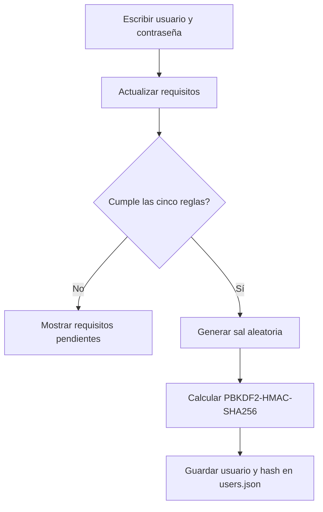
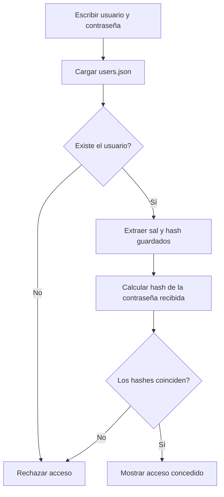

# Práctica 4: Algoritmo Hash

Este proyecto implementa un sistema sencillo de registro e inicio de sesión con
Tkinter. Los usuarios se guardan en `users.json` y las contraseñas nunca se
almacenan como texto plano.

## Estructura

```text
Practica HASH/
├── main.py
├── users.json
└── utils/
    ├── login_app.py
    ├── saveJson.py
    └── secureAES.py
```

- `main.py`: inicia la aplicación gráfica.
- `utils/login_app.py`: registro, validación de contraseñas y login.
- `utils/saveJson.py`: lectura y escritura de `users.json`.
- `users.json`: base de datos local de usuarios y hashes.
- `utils/secureAES.py`: utilidades AES independientes; no son necesarias para
  el flujo actual de autenticación.


## Ejecución

Desde la carpeta del proyecto:

```bash
cd "Practica HASH"
python3 main.py
```

Se abrirá una ventana con las opciones:

- **Iniciar sesión**: comprueba el usuario y la contraseña.
- **Registrarse**: crea un usuario nuevo.
- **Limpiar**: borra los campos del formulario.

Al registrarse, el usuario se guarda automáticamente en `users.json`.

## Requisitos de contraseña

La contraseña solo se acepta cuando cumple las cinco condiciones siguientes:

1. Tiene al menos 8 caracteres.
2. Contiene letras mayúsculas y minúsculas.
3. No contiene secuencias alfanuméricas ascendentes o descendentes, como
   `abc`, `123` o `987`.
4. Contiene al menos un carácter especial.
5. No contiene el nombre del usuario, sin distinguir mayúsculas y minúsculas.

Los indicadores de estas condiciones se actualizan cada vez que se escribe en
el usuario o en la contraseña.

## Almacenamiento de contraseñas

Una contraseña válida se procesa con:

```text
PBKDF2-HMAC-SHA256
```

Para cada usuario se genera una sal aleatoria de 16 bytes y se realizan
200 000 iteraciones. El valor guardado tiene este formato:

```text
sal_hexadecimal$hash_hexadecimal
```

Ejemplo de estructura de `users.json`:

```json
{
    "cesar": "sal_hexadecimal$hash_hexadecimal"
}
```

La contraseña original no se guarda. Durante el login, se extrae la sal del
registro, se calcula nuevamente el hash y se compara con `hmac.compare_digest`.

## Flujo de registro



## Flujo de inicio de sesión



## Análisis de seguridad

- La sal aleatoria evita que dos usuarios con la misma contraseña tengan el
  mismo hash.
- PBKDF2 hace más costoso probar muchas contraseñas automáticamente.
- `hmac.compare_digest` evita una comparación simple susceptible a diferencias
  de tiempo.
- La validación de complejidad reduce contraseñas débiles, pero no reemplaza
  una política contra contraseñas filtradas.
