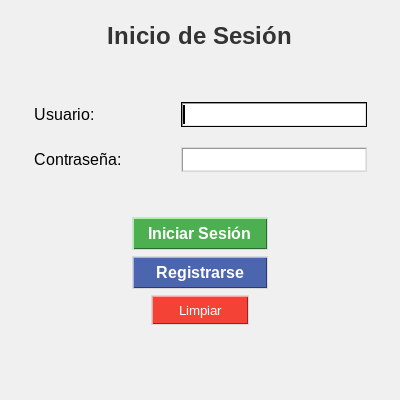
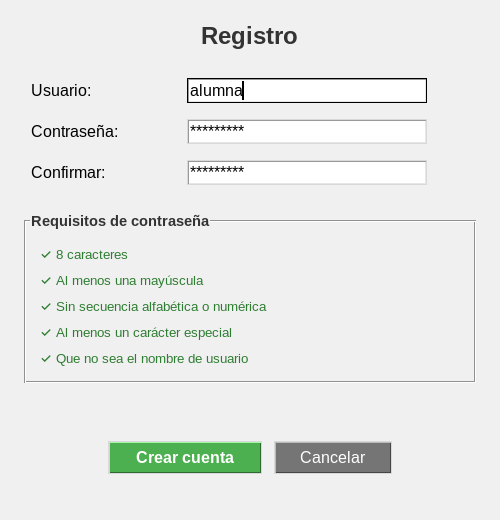
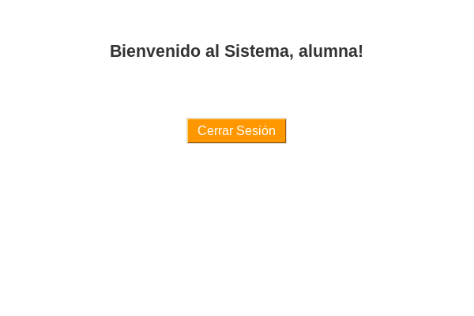

# Resultados — Práctica 04: LoginHash

## Pantalla de inicio

La aplicación abre el formulario principal con campos separados para usuario y
contraseña, oculta la contraseña y ofrece las acciones de inicio de sesión,
registro y limpieza.

*Captura 1. Formulario inicial de autenticación.*

## Validación del registro

Se abrió el formulario de registro y se introdujo una contraseña de prueba que
satisface las cinco reglas. La interfaz actualizó visualmente cada condición:
longitud mínima, mayúscula, ausencia de secuencias, carácter especial y
diferencia respecto al usuario.

*Captura 2. Validación dinámica de una contraseña correcta. Los caracteres se
mantienen ocultos en ambos campos.*

## Inicio de sesión correcto

Para comprobar la autenticación se calculó el hash SHA-256 de la contraseña de
prueba, se proporcionaron las credenciales correspondientes y se ejecutó la
acción de inicio de sesión. El sistema comparó los hashes y abrió el dashboard.

*Captura 3. Panel mostrado únicamente después de validar correctamente las
credenciales.*

## Verificación

El flujo comprobado fue:

1. carga del formulario principal;
2. apertura del registro;
3. actualización de las cinco validaciones de contraseña;
4. cálculo y comparación del hash SHA-256;
5. acceso al dashboard con una sesión válida.

Las tres ventanas renderizaron contenido correctamente y el flujo terminó sin
errores de ejecución. La base de usuarios de la práctica no se modificó para
producir estas evidencias; la credencial de prueba se mantuvo solamente en
memoria.
