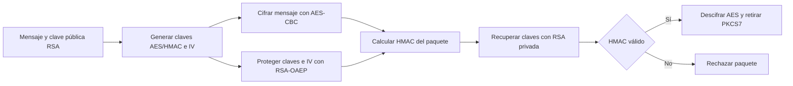

# Seguridad Informática — 67406 Moran

Alumno: Moran Escalante Bryan Arturo. Código fuente de las prácticas 02, 03 y 04.

## Preparación

Python 3.10 o posterior. Desde la raíz del repositorio:

```sh
python -m venv .venv
# Windows PowerShell:
.venv\Scripts\Activate.ps1
python -m pip install -r P03-HIBRIDO/requirements.txt
```

## P02 — RSA

```sh
python P02-RSA/algoritmo_rsa.py
```

Introducir `5561` para n y `4` para seleccionar el cuarto candidato.
Resultado comprobado: p=67, q=83, phi=5412, e=17, d=4457 y mensaje
`HOLA MUNDO`. El código fue recuperado de las dos últimas páginas del PDF
de la práctica, reparando un salto de línea dentro de una cadena.
Se conserva el procedimiento original. Es un ejercicio con números pequeños;
no es una implementación RSA para proteger información real. Su entrada prevista
es el valor de n de esta práctica.

## P03 — Híbrido RSA/AES

```sh
python P03-HIBRIDO/algoritmo_hibrido.py --mensaje "Hola Mundo"
python -m unittest discover -s P03-HIBRIDO -v
```

AES-256-CBC cifra el texto con PKCS7. RSA-2048/OAEP-SHA256 protege la clave
AES, el IV y una clave HMAC independiente. HMAC-SHA256 comprueba la integridad
antes de descifrar AES. La clave AES mide 32 bytes y el IV mide 16 bytes,
el tamaño requerido por CBC; la guía indica 32 bytes para el IV.
Las claves y el IV se generan en cada ejecución; no se guardan claves privadas.



Incluye 17 pruebas: textos Unicode, límites de bloque, mensajes largos,
aleatoriedad, claves incorrectas, alteraciones, truncamientos y validaciones.
Es una demostración local; no autentica la identidad del emisor ni evita
la reproducción de paquetes válidos.

## P04 — Hash y login

```sh
python P04-HASH/main.py
python -m unittest discover -s P04-HASH -v
```

Interfaz Tkinter con registro, inicio de sesión, reglas visibles de contraseña
y almacenamiento de hashes SHA-256. Tkinter debe estar disponible en Python.
La base `P04-HASH/utils/users_db.json` se crea al registrar el primer usuario;
se excluye de Git para no publicar usuarios ni hashes de contraseñas.
SHA-256 directo se conserva como parte del ejercicio; para un sistema real
se debe utilizar una función de derivación de contraseñas con sal.

Los auxiliares originales `secureAES.py` y `saveJson.py` se conservan.
El login no los importa; para utilizar `secureAES.py` se requiere:

```sh
python -m pip install -r P04-HASH/requirements.txt
```

La guía `P04-HASH/INSTRUCTIONS.MD` del repositorio de clase repite la consigna
de RSA/AES. La implementación Hash corresponde al ZIP proporcionado.
